# ShaderCandy

ShaderCandy is a cross-platform screensaver application that renders real-time procedural graphics using native GPU APIs. It supports macOS (Metal) and Linux (OpenGL/X11/Wayland).

## Key Features

* **Cross-Platform Native Rendering**: Uses Metal on macOS and OpenGL/Wayland/X11 on Linux for direct hardware access.
* **SIMD Optimizations**: Implements SIMD-accelerated math operations for CPU-side calculations (ARM NEON on Apple Silicon, AVX2 on x86_64).
* **Modular Shader Architecture**: Provides a shared library of GLSL and Metal shader functions (noise, SDFs, math utilities) to simplify effect creation.
* **Hot Reloading**: inotify-based file watcher with `#include` caching (mtime-based invalidation) for instant shader recompilation on save.
* **Audio Reactivity**: Microphones and system audio input feed directly into FFT spectral analysis with Audio Utils (`packAudioForShader`, `getDominantFrequency`, `getSpectralCentroid`, `bandHasEnergy`).
* **Bloom Post-Processing**: FBO-based bloom pipeline with configurable quality levels (Low/Medium/High/Ultra) and Gaussian blur passes.
* **Headless Rendering**: `HeadlessRenderer` with ffmpeg video encoding (PNG/JPG/PPM output) and offscreen FBO rendering.
* **Neural Effects**: Integrated CoreML neural style transfer engine on macOS (macOS-only).
* **Dynamic Control Systems**: Configurable UI for shader selection, preset save/load, multi-display support, screenshot hotkeys, and OSD notifications.
* **Advanced Particle Systems**: High-performance compute shader integration for generative multi-million particle simulations.
* **Shader Cycling**: Configurable per-shader duration with smooth crossfade transitions between effects.

## Architecture

```mermaid
graph TD
    Root[ShaderCandy Repository] --> Shaders[shaders/]
    Root --> Src[src/]
    Root --> Tests[tests/]
    Root --> Docs[docs/]
    Root --> Install[install/]

    Shaders --> SBase["base/ (common.metal, common.glsl, utils)"]
    Shaders --> SEffects["effects/ (raymarching, fractals, visual effects)"]
    Shaders --> SMusic["music/ (audio-reactive genre shaders)"]
    Shaders --> SAudio["audio/ (audio visualization shaders)"]
    Shaders --> SNeural["neural/ (neural style transfer)"]

    Src --> Core["core/ (ShaderManager, MultiDisplay, HeadlessRenderer, Uniforms, Performance)"]
    Src --> Metal["metal/ (MetalRenderer, PipelineCache, HeapManager)"]
    Src --> GL["gl/ (GLRenderer, GLRendererTypes, UniformUploader, GLShaderCompiler)"]
    Src --> Platform["platform/ (macos, linux x11/wayland)"]
    Src --> Audio["audio/ (AudioInput, AudioUtils, AcousticSimulator)"]
    Src --> Config["config/ (ConfigurationManager, Presets)"]

    Tests --> T1["9 test suites / 101 tests"]
```



## Building and Installation

### Prerequisites

* **macOS**: Xcode Command Line Tools, CMake 3.20+
* **Linux**: GCC/Clang (C++17), CMake 3.20+, X11 development headers (`libx11-dev`, `libxss-dev`)

### macOS Build

```bash
git clone https://github.com/23skdu/ShaderCandy.git
cd ShaderCandy
./install/install_macos.sh
```

### Linux Build

```bash
git clone https://github.com/23skdu/ShaderCandy.git
cd ShaderCandy
./install/install_linux.sh
```

### Manual Build (CMake)

```bash
mkdir build && cd build
cmake .. -DCMAKE_BUILD_TYPE=Release -DCMAKE_CXX_STANDARD=17
make -j$(nproc)
```

### Build Options

| Option | Default | Description |
|--------|---------|-------------|
| `BUILD_TESTS` | ON | Build test suite |
| `BUILD_AUDIO` | ON | Build audio support (ALSA/PulseAudio + FFTW3) |
| `BUILD_SCREENSAVER_LINUX` | ON | Build X11 screensaver |
| `BUILD_SCREENSAVER_WAYLAND` | ON | Build Wayland screensaver |
| `BUILD_STANDALONE_PLAYER` | ON | Build standalone player (requires GLFW) |
| `BUILD_WALLPAPER` | ON | Build wallpaper mode |

## Testing

```bash
# Build with tests enabled
cmake .. -DBUILD_TESTS=ON -DCMAKE_CXX_STANDARD=17
make

# Run all tests (101 tests across 9 suites)
./shadercandy-test

# Run specific test suite
./shadercandy-test --run "Math & SIMD Tests"
```

**Test Suites:**
- Logic & Uniform Tests
- Math & SIMD Tests
- Core Functionality Tests
- Shader Compilation Tests (52+ fragment shaders)
- Renderer Feature Tests
- Coverage Expansion Tests
- Shader Regression Tests
- Shader Wrapper Tests
- Linux Platform & Audio Tests
- Memory Leak & Cleanup Tests

## Keyboard Controls (Screensaver)

| Key | Action |
|-----|--------|
| Right Arrow / Space / P | Next shader |
| Left Arrow / N | Previous shader |
| D | Toggle debug overlay |
| T | Run test suite |
| F12 / PrintScreen | Screenshot |
| 1-4 | Adjust parameters |
| 5 | Cycle color palette |
| Tab | Switch display |
| Ctrl+S | Save preset |
| Ctrl+O | Load preset |
| Ctrl+/- | Adjust intensity |
| Escape / Q | Quit |

## Performance Benchmarks

Rough performance metrics on reference hardware (4K resolution):

| Hardware | Effect | FPS |
| :--- | :--- | :--- |
| Apple M2 | Nebula | 60 |
| Apple M2 | Mandelbulb | 60 |
| RTX 3060 | Ray March | 60 |
| Intel Iris Xe | Nebula | ~45 |

## Shader Gallery

ShaderCandy ships with **110+ shaders** across multiple categories:

* **Fractals**: Mandelbulb, Mandelbrot, Julia Set variants, Burning Ship, Sierpinski
* **Audio-Reactive**: Audio bars, spectrum, wave, ray tracing, circular visualizer
* **Music**: Genre-themed effects (jazz, hip-hop, electronic, classical, etc.)
* **Abstract**: Plasma, kaleidoscope, vortex, reaction-diffusion, fluid dynamics
* **Nature & Environment**: Aurora, fireflies, forest, galaxy, ocean, snow
* **Character & Creature**: Dragon, knights, orcs, owl, unicorn, elves

## Documentation

* `docs/ShaderCandyMasterPlan.md` -- Consolidated project architecture and feature status
* `docs/ArchitectureDiagrams.md` -- Visual architecture diagrams for rendering, audio, and core systems
* `docs/ApplicationModesGuide.md` -- User guide for Standalone Player, Wallpaper Mode, and Screensavers
* `docs/ShaderAuthoringGuide.md` -- Developer guide for creating and translating shaders (Metal & GLSL)
* `docs/LinuxFeatures.md` -- Linux platform architecture, Wayland/X11 details, and build instructions
* `docs/HdrImplementation.md` -- High-bit-depth rendering and tone mapping documentation
* `docs/nextsteps.md` -- Active performance and stability engineering roadmap
* `docs/release_notes_0_1_0.md` -- v0.1.0 release notes
* `docs/release_notes_0_2_0.md` -- v0.2.0 release notes
* `docs/NeuralEffectsGuide.md` -- CoreML neural style transfer engine guide (macOS-only)

## CI/CD

GitHub Actions CI runs on every push and PR (all actions v4):
- Builds on Ubuntu with full dependency matrix
- Runs the full test suite (101 tests)
- Static analysis with clang-tidy and cppcheck
- Memory leak detection with valgrind (0 application errors)

## License

This project is released into the public domain under the [Unlicense](LICENSE).
See [LICENSE](LICENSE) for details.
