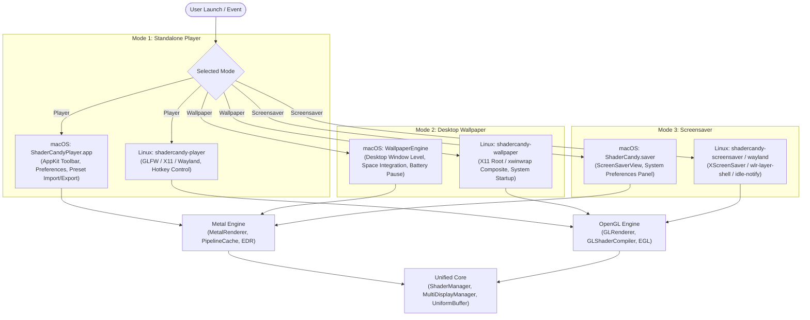
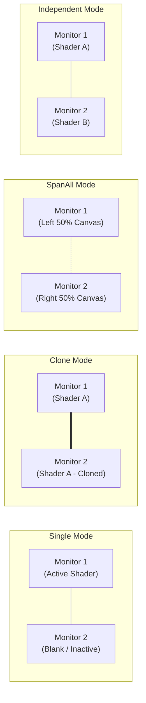

# ShaderCandy Application & Desktop Modes Guide

ShaderCandy provides three distinct execution modes across macOS and Linux:
1. **Standalone Player Mode**: Resizable, windowed or fullscreen interactive player with UI controls, preset management, and parameter adjustments.
2. **Desktop Wallpaper Mode**: Real-time procedural wallpaper rendering behind desktop icons and windows.
3. **Screensaver Mode**: Lock-screen and idle screensaver with automatic wake detection and display power management.

---

## Architecture Overview



---

## 1. Standalone Player Mode

The standalone player allows interactive browsing, fine-tuning, and full-screen visualization of all procedural shaders.

### Installation & Launch

#### macOS
- **Binary**: Launch `ShaderCandyPlayer.app` from `/Applications`.
- **Command Line**:
  ```bash
  /Applications/ShaderCandyPlayer.app/Contents/MacOS/ShaderCandyPlayer --shader nebula --fps 60
  ```

#### Linux
- **Binary**: Run `shadercandy-player` from terminal or application launcher.
- **Command Line**:
  ```bash
  # Launch default player
  shadercandy-player

  # Launch specific shader with audio reactivity in fullscreen
  shadercandy-player -shader nebula -fullscreen -audio

  # Launch with custom dimensions
  shadercandy-player -width 2560 -height 1440 -fps 60
  ```

### CLI Reference

| Option | Argument | Description |
| :--- | :--- | :--- |
| `-shader` / `--shader` | `<name>` | Launch directly into specified shader (e.g. `mandelbulb_3d`, `nebula`) |
| `-fullscreen` / `--fullscreen`| None | Launch in exclusive fullscreen mode |
| `-audio` / `--audio` | None | Enable real-time microphone/system audio analysis |
| `-fps` / `--fps` | `<int>` | Target frame rate cap (default: `60`) |
| `-width` / `-height` | `<int>` | Initial window dimensions (Linux) |
| `-shaders` / `--shaders` | `<path>` | Path to custom shader directory |
| `-help` / `--help` | None | Display command-line usage manual |

---

## 2. Desktop Wallpaper Mode

Live procedural wallpapers replace static desktop backgrounds with animated graphics.

### macOS Live Wallpaper

Managed by `WallpaperEngine`, rendering behind desktop icons at window level `kCGDesktopWindowLevel - 1`:

```bash
# Enable wallpaper mode via player binary
ShaderCandyPlayer.app/Contents/MacOS/ShaderCandyPlayer --wallpaper

# Clear wallpaper and restore static desktop
ShaderCandyPlayer.app/Contents/MacOS/ShaderCandyPlayer --clear-wallpaper
```

#### Programmatic Objective-C API
```objc
WallpaperEngine *engine = [WallpaperEngine sharedEngine];
[engine start];

// Apply shader to all displays
[engine setWallpaperForAllDesktops:@"nebula"];

// Set unique shader per display
[engine setWallpaperForDesktop:@"Display-1" withShader:@"plasma"];
[engine setWallpaperForDesktop:@"Display-2" withShader:@"mandelbulb_3d"];

// Power saving: automatically pause on battery
engine.pauseOnBattery = YES;
engine.targetFPS = 30;
```

### Linux Live Wallpaper

On Linux, `shadercandy-wallpaper` renders into the root window or via `xwinwrap`:

```bash
# Basic usage with X11 compositor (Picom / Compton)
shadercandy-wallpaper -shader ./shaders/effects/nebula.frag

# Recommended: xwinwrap wrapper for window-manager transparency
xwinwrap -ov -fs -- shadercandy-wallpaper -shader ./shaders/effects/plasma.frag -audio
```

#### Persistent Autostart on Linux
Add to `~/.xprofile`, `~/.xinitrc`, or window manager config (`~/.config/i3/config`, `hyprland.conf`):
```bash
xwinwrap -ov -fs -- shadercandy-wallpaper -shader /usr/share/shadercandy/shaders/effects/nebula.frag &
```

---

## 3. Screensaver Mode

### macOS Installation
1. Build screensaver: `make -j$(nproc)`
2. Install bundle: `./install/install_macos.sh` (copies to `~/Library/Screen Savers/ShaderCandy.saver`).
3. Open **System Settings $\rightarrow$ Lock Screen / Screen Saver**, select **ShaderCandy**, and click **Options** to select default presets.

### Linux Installation
1. Build screensaver: `cmake .. -DBUILD_SCREENSAVER_LINUX=ON && make`
2. Install binaries: `sudo make install`
3. Configure `~/.xscreensaver`:
   ```
   programs: \
     shadercandy-screensaver -root \n\
   ```
4. For native Wayland compositors (Sway, Hyprland):
   ```bash
   shadercandy-wayland --shader ./shaders/effects/plasma.glsl
   ```

---

## Unified Keyboard Controls

All operational modes across both platforms implement identical keyboard shortcuts:

| Shortcut | Action | Scope |
| :--- | :--- | :--- |
| **Escape** / **Ctrl+Q** | Quit application / Exit screensaver | All Modes |
| **Right Arrow** / **Space** / **P** | Next shader in catalog | All Modes |
| **Left Arrow** / **N** | Previous shader in catalog | All Modes |
| **F12** / **PrintScreen** | Take high-resolution screenshot | All Modes |
| **1 – 5** | Adjust shader speed & parameter presets | All Modes |
| **Ctrl+S** | Save active configuration as JSON preset | All Modes |
| **Ctrl+O** | Load saved JSON preset | All Modes |
| **Tab** | Cycle active multi-monitor display target | All Modes |
| **Ctrl++** / **Ctrl+-** | Increase / decrease visual intensity | All Modes |
| **D** | Toggle on-screen performance debug overlay (FPS, P99, GPU ms) | All Modes |
| **T** | Trigger internal test suite verification | All Modes |
| **F** / **F11** | Toggle fullscreen mode | Standalone Player |
| **R** | Force recompile and reload current shader | Standalone Player |

---

## Multi-Display Canvas Spanning

ShaderCandy's `MultiDisplayManager` provides four spanning strategies across multi-monitor setups:



- **`Single`**: Executes the active shader solely on the primary display.
- **`SpanAll`**: Computes the global bounding box of all displays and stretches a seamless virtual canvas across the entire monitor wall.
- **`Clone`**: Broadcasts the identical animation and uniform state to every display.
- **`Independent`**: Assigns unique procedural shaders and independent parameter sets to each display output.

---

## JSON Preset Format

Presets allow saving and sharing customized parameter sets across platforms:

```json
{
  "version": "1.0",
  "name": "Cosmic Neon",
  "author": "ShaderCandy",
  "description": "High-intensity neon nebula with audio responsiveness",
  "shader": "nebula",
  "parameters": {
    "speed": 1.25,
    "intensity": 1.75,
    "alpha": 1.0,
    "bloomThreshold": 0.65,
    "bloomIntensity": 1.2
  },
  "globalSettings": {
    "targetFPS": 60,
    "vrsEnabled": true,
    "hdrEnabled": true
  }
}
```

- **Exporting**: Press `Ctrl+S` or choose **File $\rightarrow$ Export Preset**.
- **Importing**: Press `Ctrl+O` or pass preset file path on CLI.

---

## Power & Battery Management

To maximize laptop battery life when running wallpapers or background players:

1. **Automatic Battery Pause**:
   - `WallpaperEngine` queries `IOPSCopyPowerSourcesInfo` every 10 seconds. When AC power is disconnected, rendering stops or drops to 15 FPS.
2. **Adaptive Frame Scaling**:
   - Set `targetFPS = 30` or `15` when running in wallpaper mode.
3. **Screen Lock Pause**:
   - Automatically halts GPU drawing passes when the user locks their session or when monitors enter power save mode.

---

## Troubleshooting

### Wallpaper Does Not Appear (macOS)
- Check **System Settings $\rightarrow$ Privacy & Security $\rightarrow$ Accessibility** and ensure ShaderCandy has permission to manage desktop windows.

### Wallpaper Does Not Appear (Linux)
- Verify an active composite manager is running: `pgrep -a picom || pgrep -a compton`.
- Ensure the XComposite extension is active: `xdpyinfo | grep -i composite`.
- If your desktop environment draws over the root window (e.g. GNOME/KDE desktop icons), launch via `xwinwrap -ov -fs -- shadercandy-wallpaper ...`.

### Low Frame Rates
- Enable dynamic resolution or lower `targetFPS` to 30 FPS.
- Disable compute bloom for heavy fractals on lower-tier hardware.
- Reduce multi-monitor spanning mode to `Single`.
