# ShaderCandy Architecture Diagrams

This document contains visual architectural specifications of key systems in ShaderCandy.

---

## 1. Rendering Pipelines

### macOS Metal Advanced Rendering Flow
Shows the full frame lifecycle on macOS including Dynamic Variable Rate Shading (VRS), Compute-Based Bloom, and HDR Tone Mapping:

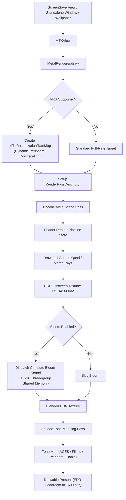

### Linux OpenGL Rendering Flow
Shows X11 / Wayland surface binding and OpenGL 3.3+ frame execution:

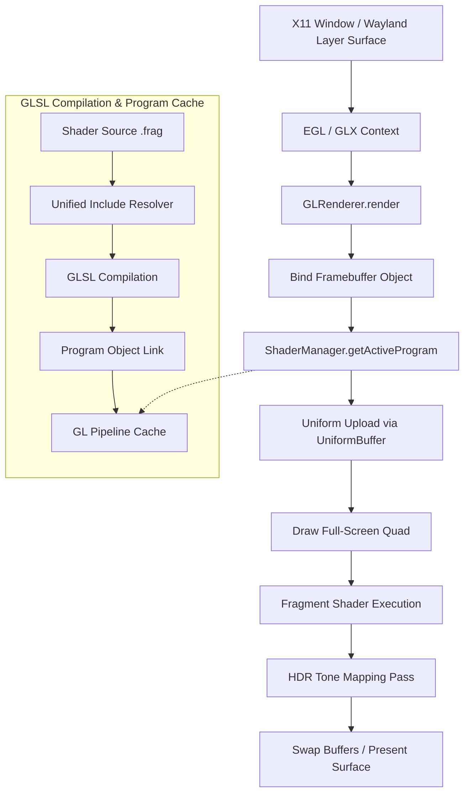

---

## 2. Multi-Display Virtual Canvas & Spanning System

The `MultiDisplayManager` coordinates display geometry, virtual-to-physical coordinate transformations, and headless offscreen rendering across heterogeneous monitor setups:

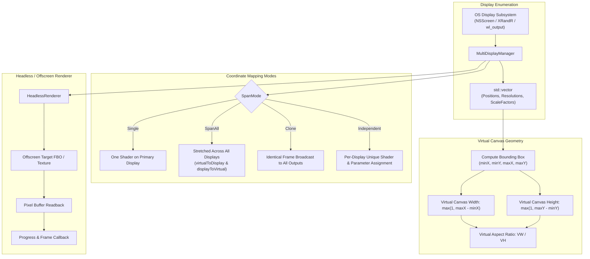

---

## 3. Dynamic VRS & Compute-Based Bloom Pipeline

Illustrates how Apple Silicon hardware features (Tile Memory and Variable Rate Shading) optimize fragment workload:

```mermaid
flowchart LR
    subgraph "1. Rate Map Generation"
        PM[PerformanceMonitor] --> VRS["VRS Tier Selector\n(M1+: 1/2, 1/4 Peripheral Rates)"]
        VRS --> RMD["MTLRasterizationRateMapDescriptor"]
        RMD --> RMap["MTLRasterizationRateMap Alloc"]
    end

    subgraph "2. Primary Render Pass"
        RMap --> RP["MTLRenderPassDescriptor\n.rasterizationRateMap = RMap"]
        RP --> FS["Fragment Shader / Raymarcher\n(Coarser Shading in Periphery)"]
        FS --> OutTex["HDR Render Target\n(RGBA16Float)"]
    end

    subgraph "3. Tile Compute Bloom"
        OutTex --> CS["Compute Command Encoder"]
        CS --> TG["16x16 Threadgroup Tile Memory\n(Zero Intermediate Fullscreen Quads)"]
        TG --> Bright["Bright Pass Threshold"]
        Bright --> Blur["Two-Pass Separable Gaussian Blur"]
        Blur --> BloomTex["Final Bloom Texture"]
    end

    subgraph "4. Composite & Present"
        OutTex & BloomTex --> Comp["Composite & Tone Map Pass"]
        Comp --> BackBuffer["MTKView Current Drawable"]
    end
```

---

## 4. Audio Processing & MPS Spatial Audio Pipeline

### FFT Audio Reactivity System
Translates raw microphone or system audio input into spectral energy bands and beat uniforms:

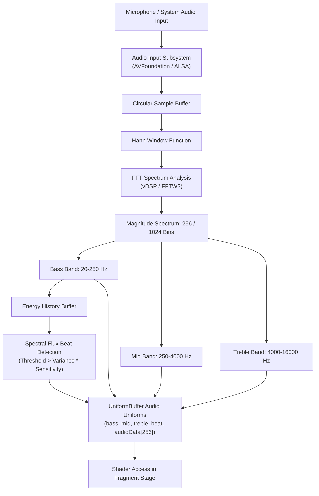

### Metal Performance Shaders (MPS) Spatial Audio Ray-Tracing
Hardware-accelerated acoustic room simulation for realistic spatial reflection and occlusion:

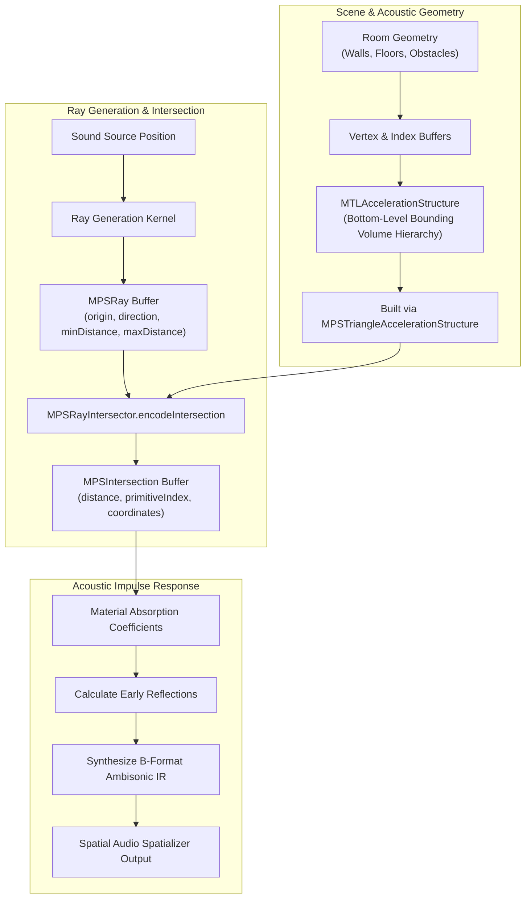

---

## 5. Neural Style Transfer System

GPU-accelerated CoreML style transfer pipeline running on Apple Neural Engine (ANE) and Metal:

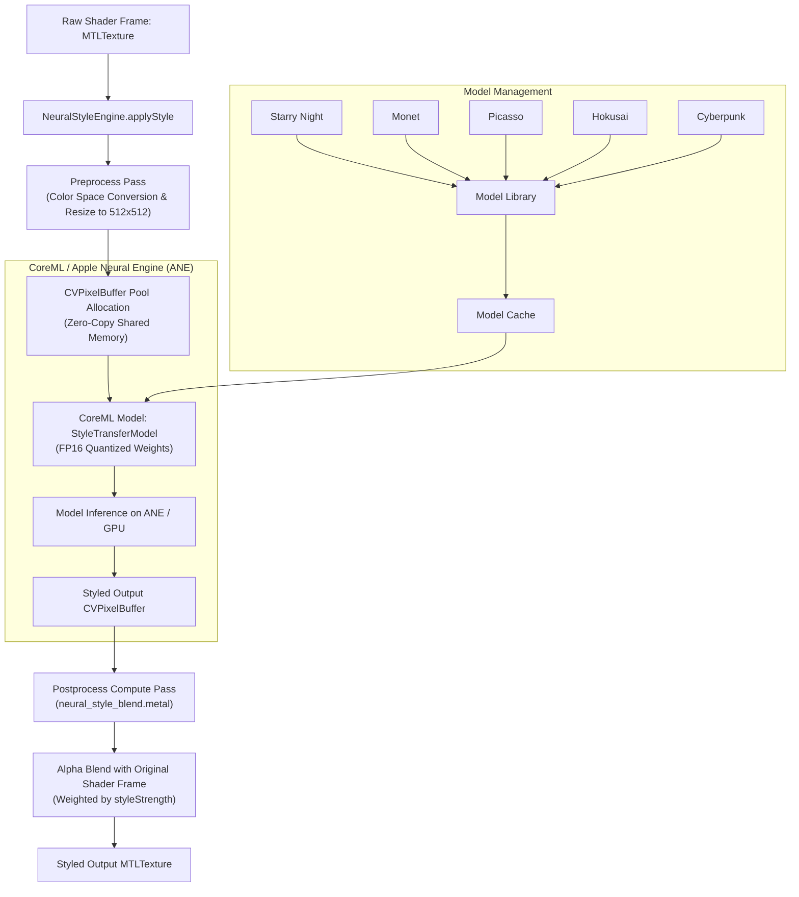

---

## 6. Unified ShaderManager & Hot-Reload Observer Pattern

The cross-platform `UnifiedShaderManager` provides centralized discovery, recursive include resolution, and hot reloading:

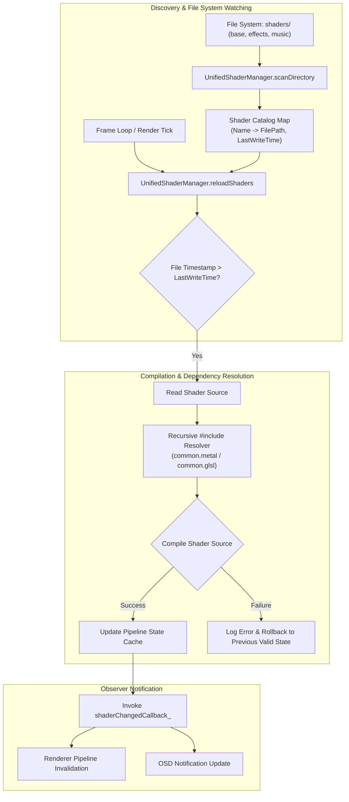

---

## 7. Uniform Buffer Data Flow

Double-buffered CPU-to-GPU data synchronization ensuring zero frame tearing:

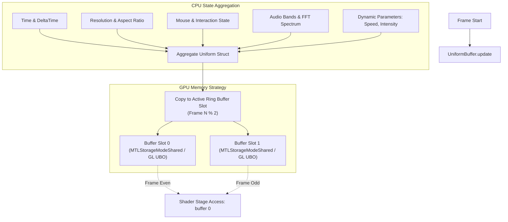

---

## 8. Test Framework & Regression Architecture

Comprehensive test suite integrating unit validation, coverage expansion, and compilation regression checks:

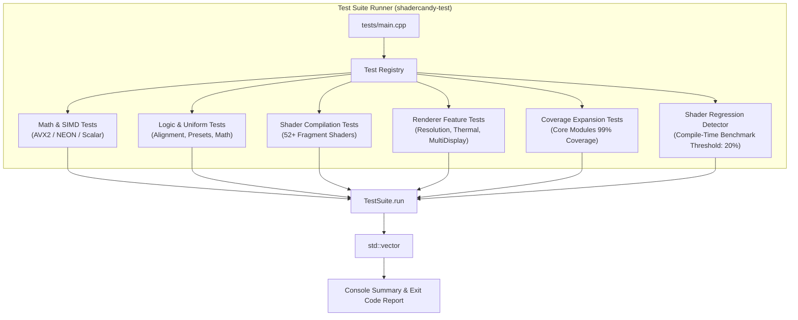

---

## 9. Project Directory Layout

```mermaid
graph TD
    Root[ShaderCandy Repository] --> Shaders[shaders/]
    Root --> Src[src/]
    Root --> Tests[tests/]
    Root --> Docs[docs/]
    Root --> Install[install/]

    Shaders --> SBase["base/ (common.metal, common.glsl, utils)"]
    Shaders --> SEffects["effects/ (raymarching, fractals, visual effects)"]
    Shaders --> SMusic["music/ (audio-reactive genre shaders)"]

    Src --> Core["core/ (ShaderManager, MultiDisplay, Uniforms, Performance)"]
    Src --> Metal["metal/ (MetalRenderer, PipelineCache, HeapManager)"]
    Src --> GL["gl/ (GLRenderer, GLShaderCompiler)"]
    Src --> Platform["platform/ (macos, linux x11/wayland)"]
    Src --> Audio["audio/ (AudioInput, AcousticSimulator)"]
    Src --> Neural["neural/ (NeuralStyleEngine, StyleModel)"]
    Src --> Config["config/ (ConfigurationManager, Presets)"]

    Docs --> D1["nextsteps.md (Active Roadmap)"]
    Docs --> D2["ShaderCandyMasterPlan.md (Architecture Master)"]
    Docs --> D3["ArchitectureDiagrams.md (This Document)"]
    Docs --> D4["ApplicationModesGuide.md (User Guide)"]
    Docs --> D5["ShaderAuthoringGuide.md (Developer Guide)"]
    Docs --> D6["LinuxFeatures.md (Linux Platform)"]
    Docs --> D7["HdrImplementation.md (HDR Specification)"]
    Docs --> D8["NeuralEffectsGuide.md (CoreML System)"]
    Docs --> D9["shaders.md (110+ Shader Catalog)"]
```
