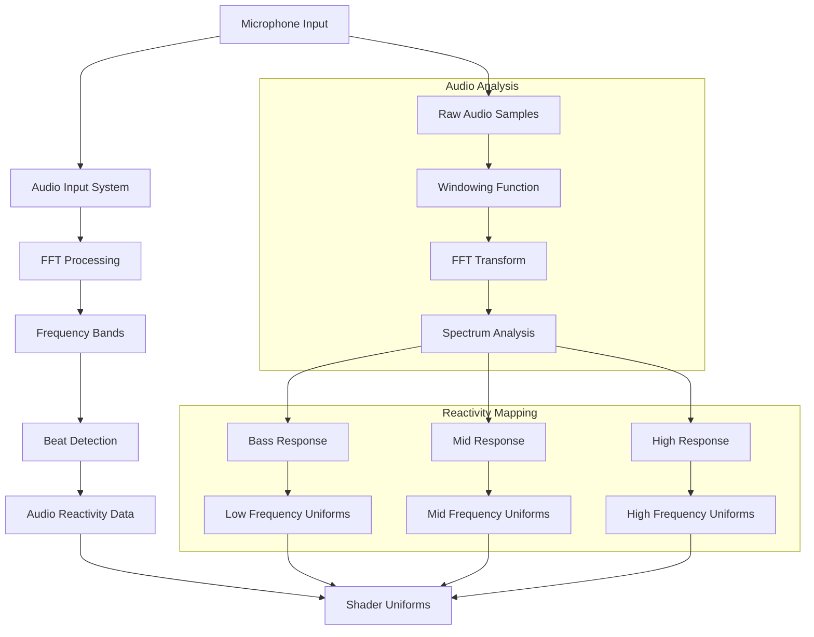
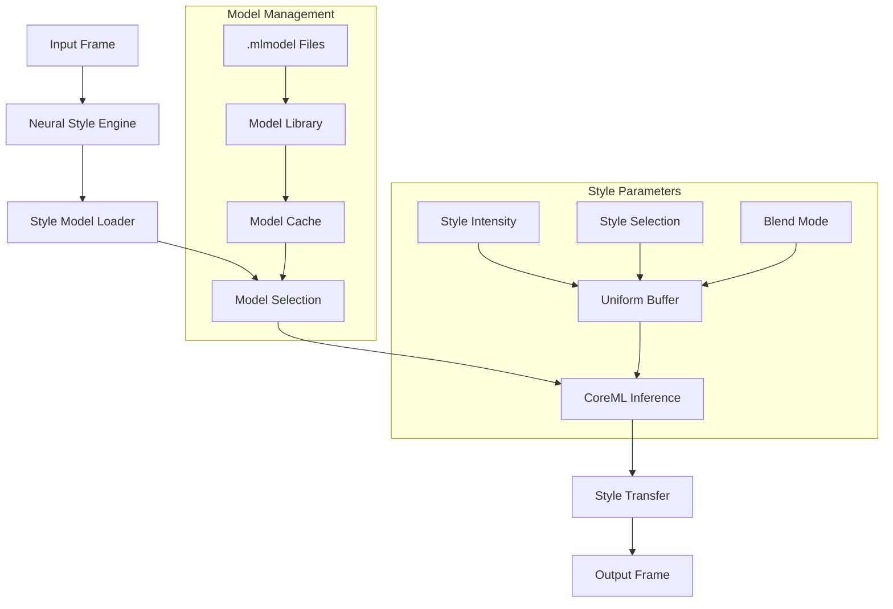
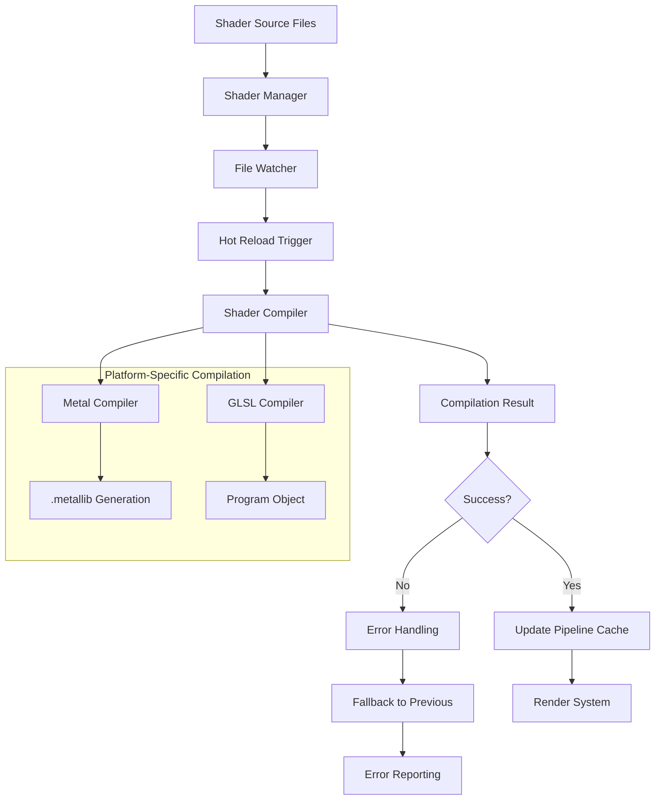
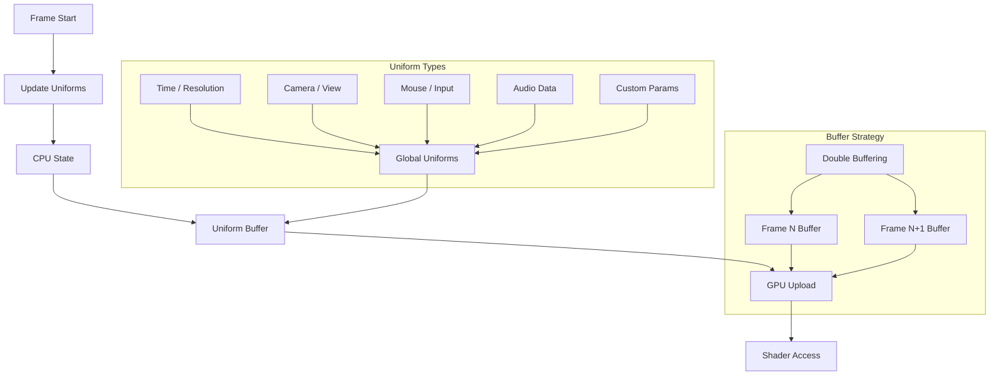
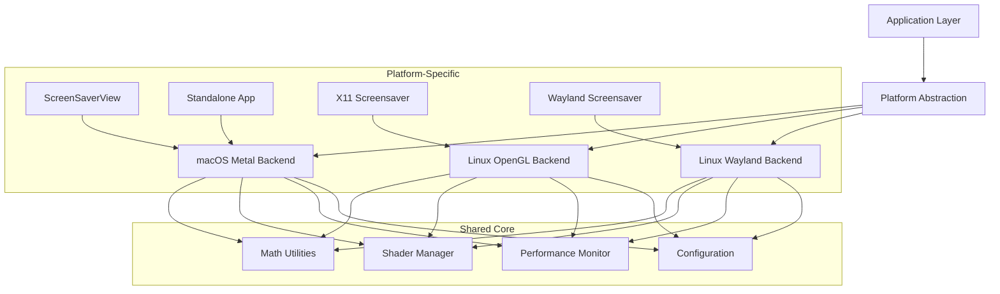
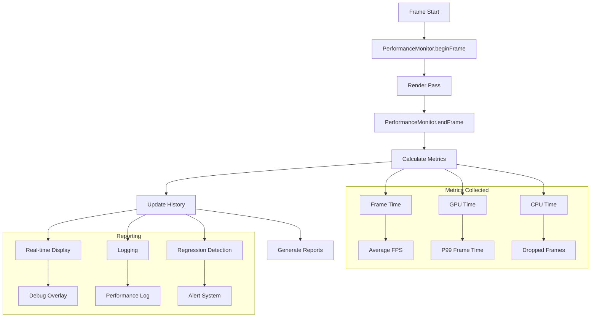
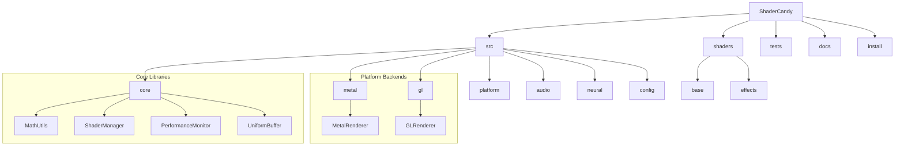
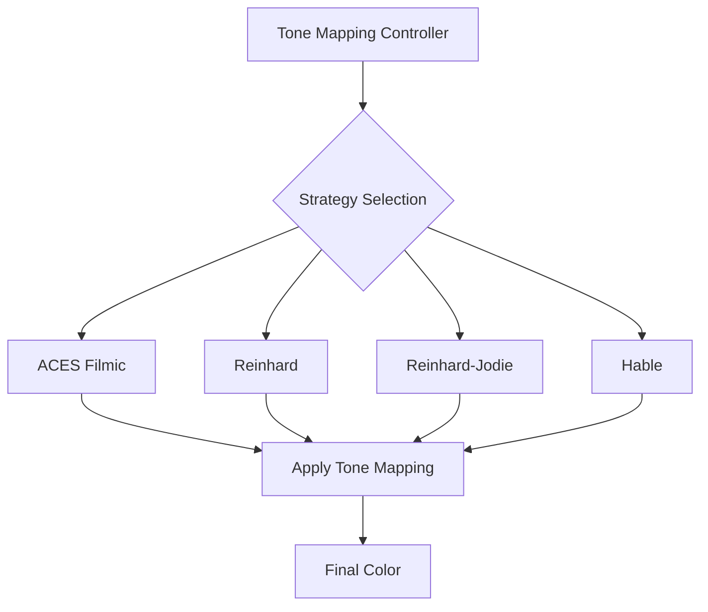

# ShaderCandy Architecture Diagrams

This document contains visual documentation of key systems in ShaderCandy.

## Rendering Pipeline

### macOS Metal Rendering Flow

```mermaid
flowchart TD
    A[ScreenSaverView / Standalone Window] --> B[MTKView]
    B --> C[Metal Renderer]
    C --> D[Shader Compiler]
    D --> E[Render Pipeline State]
    E --> F[Command Buffer]
    F --> G[Render Encoder]
    G --> H[Frame Rendered]

    subgraph "Shader Pipeline"
        I[Shader Source (.metal)] --> J[Runtime Compilation]
        J --> K[Function Library]
        K --> L[Pipeline Cache]
    end

    subgraph "Uniform Management"
        M[Uniform Buffer] --> N[CPU -> GPU Upload]
        N --> O[Shader Uniforms]
    end

    D --> I
    L --> E
    M --> O
```

### Linux OpenGL Rendering Flow

```mermaid
flowchart TD
    A[X11 Window / Wayland Surface] --> B[OpenGL Context]
    B --> C[GL Renderer]
    C --> D[Shader Compiler]
    D --> E[Shader Program]
    E --> F[Render Loop]
    F --> G[Draw Calls]
    G --> H[Frame Rendered]

    subgraph "Shader Pipeline"
        I[Shader Source (.frag/.glsl)] --> J[GLSL Compilation]
        J --> K[Program Object]
        K --> L[Program Cache]
    end

    subgraph "Uniform Management"
        M[Uniform Variables] --> N[CPU -> GPU Upload]
        N --> O[Shader Uniforms]
    end

    D --> I
    L --> E
    M --> O
```

## Audio System

### Audio Input Processing Flow



## Neural Style Transfer System

### CoreML Style Transfer Pipeline



## Shader Management System

### Shader Compilation and Caching



## Uniform Buffer Management

### CPU to GPU Data Flow



## Platform Abstraction Layer

### Cross-Platform Architecture



## Performance Monitoring System

### Frame Timing and Metrics



## File Structure Overview

### Directory Layout



## Key Design Patterns

### Observer Pattern for Hot Reload

```mermaid
flowchart TD
    A[File Watcher] --> B[Subject]
    B --> C[Shader Manager (Observer)]
    B --> D[Renderer (Observer)]
    B --> E[UI (Observer)]

    C --> F[Recompile Shaders]
    D --> G[Update Pipeline]
    E --> H[Show Status]
```

### Strategy Pattern for Tone Mapping



## Notes

- All diagrams use Mermaid syntax for rendering
- Diagrams can be rendered using Mermaid live editor or any Mermaid-compatible tool
- Update these diagrams when architecture changes significantly
