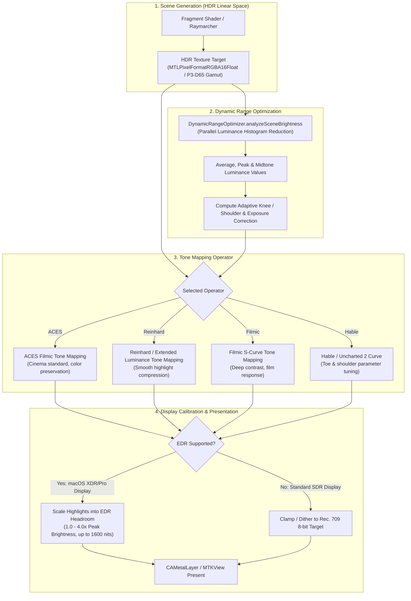

# ShaderCandy HDR Implementation Guide

## Overview

ShaderCandy's HDR pipeline provides high dynamic range rendering with 10-bit/16-bit color depth support, Apple Extended Dynamic Range (EDR), and content-adaptive tone mapping operators across cinematic color spaces.

---

## Architecture Flow



---

## Key Features

- **10-bit / 16-bit Color**: `RGBA16Float` pixel format preserving deep darks and specular highlights.
- **EDR Support**: Extended dynamic range brightness up to 1600 nits on compatible displays (Apple Liquid Retina XDR, Pro Display XDR).
- **Multiple Tone Mappers**: ACES, Reinhard, Filmic, and Hable.
- **Dynamic Range Optimization**: Real-time scene luminance analysis with adaptive knee and shoulder compression.
- **HDR Metadata**: Automated HDR10 mastering and content light level metadata generation.
- **Cross-Platform Tone Mapping**: Full hardware EDR on macOS; software-side tone mapping fallback in OpenGL on Linux.

---

## Components

| Component | Responsibility |
| :--- | :--- |
| `HDRPipeline` | Coordinates HDR texture allocation, format negotiation, and tone mapping passes |
| `DynamicRangeOptimizer` | Computes parallel luminance histograms and applies local/global exposure adaptation |
| `HDRMetadataGenerator` | Synthesizes SMPTE ST 2086 (HDR10) mastering display metadata |

---

## Tone Mapping Operators

### 1. ACES (Academy Color Encoding System)
- **Best For**: Cinema-quality cinematic output.
- **Characteristics**: Smooth highlight roll-off, wide color preservation, rich saturation.
- **Formula**:
  $$f(x) = \frac{x(2.51x + 0.03)}{x(2.43x + 0.59) + 0.14}$$

### 2. Reinhard
- **Best For**: Performance-critical paths and general-purpose scenes.
- **Characteristics**: Fast, simple, reliable compression with extended luminance support:
  $$f(x) = \frac{x(1 + \frac{x}{L_{white}^2})}{1 + x}$$

### 3. Filmic
- **Best For**: Photorealistic rendering and natural scenes.
- **Characteristics**: S-shaped film curve mimicking Kodak/Fujifilm photochemical emulsions.

### 4. Hable (Uncharted 2)
- **Best For**: Complex sci-fi scenes, high contrast, and artistic direction.
- **Characteristics**: Separate control over toe, midtone linear section, and shoulder rolloff.

---

## Color Spaces

| Color Space | Gamut Coverage | Use Case |
| :--- | :--- | :--- |
| **P3-D65** | 100% Display P3 | Native Apple displays (MacBook Pro, iMac, Studio Display) |
| **Rec. 2020** | Ultra-wide gamut | High-end HDR television and broadcast mastering |
| **Rec. 709 / sRGB** | Standard gamut | SDR fallback for standard displays |
| **scRGB** | Extended linear range | Windows HDR and cross-platform linear pipelines |

---

## Dynamic Range Optimization

```objc
typedef NS_ENUM(NSInteger, DynamicRangeMode) {
    DynamicRangeModeOff,          // Fixed linear tone mapping
    DynamicRangeModeConservative, // Safe, subtle highlight adjustments
    DynamicRangeModeAggressive,   // Maximum contrast expansion
    DynamicRangeModeAuto          // Content-adaptive adjustment based on histogram
};
```

### Parameters

| Parameter | Range | Description |
| :--- | :--- | :--- |
| `kneePoint` | 0.0 – 1.0 | Transition between shadow detail and linear midtone |
| `shoulderPoint` | 0.0 – 1.0 | Transition between linear midtone and compressed highlights |
| `shadowDetail` | 0.0 – 1.0 | Shadow lift factor preventing crushed blacks |
| `highlightDetail`| 0.0 – 1.0 | Highlight recovery amount preventing blown-out whites |

---

## Usage

### Basic HDR Setup (Metal / Objective-C)

```objc
HDRPipeline *pipeline = [HDRPipeline sharedPipeline];
[pipeline initializeWithDevice:device error:nil];

// Enable HDR
pipeline.hdrEnabled = YES;
pipeline.maxBrightness = 1000.0f; // nits
pipeline.toneMapping = ToneMappingOperatorACES;
```

### Dynamic Range Optimization

```objc
DynamicRangeOptimizer *optimizer = [[DynamicRangeOptimizer alloc] initWithDevice:device];
optimizer.mode = DynamicRangeModeAuto;
optimizer.shadowDetail = 0.6f;
optimizer.highlightDetail = 0.4f;

// Analyze scene luminance and apply correction
[optimizer analyzeSceneBrightness:hdrTexture commandBuffer:commandBuffer];
[optimizer applyOptimizationToTexture:hdrTexture commandBuffer:commandBuffer];
```

### Automatic EDR Display Detection

```objc
if ([pipeline detectHDRDisplay]) {
    pipeline.hdrEnabled = YES;
    pipeline.edrEnabled = YES;
    // Query NSScreen.maximumExtendedDynamicRangeColorComponentValue
    pipeline.maxBrightness = [pipeline currentEDRHeadroom] * 1000.0f;
}
```

---

## Performance & Benchmarks

| Hardware | Resolution | Target Format | Tone Mapper | Average FPS |
| :--- | :--- | :--- | :--- | :--- |
| **Apple M3 Max** | 4K (3840x2160) | RGBA16Float | ACES | 120 FPS |
| **Apple M2** | 4K (3840x2160) | RGBA16Float | ACES | 60 FPS |
| **Apple M1** | 4K (3840x2160) | RGBA16Float | Reinhard | 60 FPS |
| **Linux (RTX 3060)**| 4K (3840x2160) | RGBA16F / GL_FLOAT | Filmic | 60 FPS |

---

## Troubleshooting

### Color Banding
- **Cause**: Framebuffer precision downgraded to 8-bit (`RGBA8Unorm`).
- **Fix**: Ensure texture creation specifies `MTLPixelFormatRGBA16Float` or `GL_RGBA16F`.

### Blown-Out Highlights
- **Cause**: Scene peak luminance exceeds tone mapper shoulder threshold without adaptation.
- **Fix**: Switch `DynamicRangeMode` to `DynamicRangeModeAuto` or reduce `shoulderPoint`.

### Flickering Luminance
- **Cause**: Single-frame histogram spikes in scene brightness analysis.
- **Fix**: Enable temporal smoothing in `DynamicRangeOptimizer` (blending over 5–10 frames).
