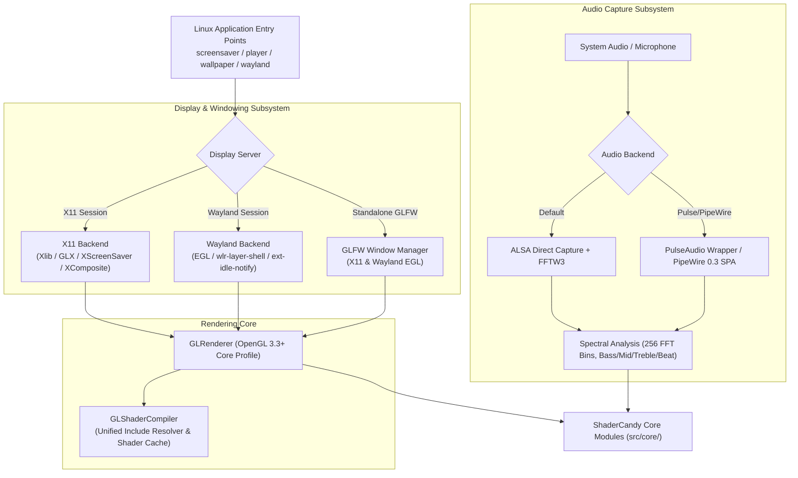

# ShaderCandy Linux Architecture & Platform Features

This document provides a technical overview of the Linux architecture, display server backends, audio drivers, and build configurations in ShaderCandy.

---

## 1. Linux Graphics & Audio Architecture

ShaderCandy on Linux runs on modern 64-bit Linux distributions with full support for both legacy X11 and native Wayland environments:



---

## 2. Key Linux Features

1. **Native Wayland Support**: Direct surface allocation and protocol handling via EGL and Wayland layer-shell (`wlr-layer-shell-unstable-v1` / `ext-idle-notify-v1`) for modern compositors (Sway, Hyprland, GNOME, KDE Plasma 6).
2. **X11 Screensaver & Root Window Integration**: Seamless attachment to XScreenSaver or direct root window rendering via XComposite extension.
3. **Low-Latency Audio Reactivity**: Direct ALSA sample capture processed through FFTW3 with 256 spectrum bins and beat detection.
4. **Standalone Player & Wallpaper Modes**: Full windowed browser and dynamic live desktop background. *(For user controls and configuration, see [ApplicationModesGuide.md](./ApplicationModesGuide.md)).*
5. **Runtime Shader Hot Reloading**: Timestamp-based directory watcher automatically recompiles GLSL files on save with immediate fallback on syntax error.

---

## 3. Audio Reactivity

The Linux audio implementation utilizes ALSA for direct hardware sample streaming and FFTW3 for Fast Fourier Transform spectral decomposition.

### Uniform Layout in GLSL Shaders

When audio is enabled (via the `-audio` CLI flag), the following global uniforms are available in shaders:

```glsl
uniform float volume;          // Overall audio volume (0.0 - 1.0)
uniform float bass;            // Low frequency energy (20-250 Hz, 0.0 - 1.0)
uniform float mid;             // Mid frequency energy (250-4000 Hz, 0.0 - 1.0)
uniform float treble;          // High frequency energy (4000-16000 Hz, 0.0 - 1.0)
uniform float beat;            // Beat detection pulse (1.0 on beat, 0.0 otherwise)
uniform float audioData[256];  // Raw FFT magnitude spectrum
```

### Usage Examples
```bash
# Screensaver with audio visualization
shadercandy-screensaver -audio

# Standalone player with audio
shadercandy-player -shader electronic -audio

# Live wallpaper with audio
shadercandy-wallpaper -shader ./shaders/effects/audio_spectrum.frag -audio
```

---

## 4. Wayland Compositor Integration

ShaderCandy provides first-class native Wayland support without requiring XWayland.

### Supported Compositors
- **Sway**: Native `wlr-layer-shell` support.
- **Hyprland**: Full layer-shell and fractional scaling support.
- **GNOME Shell**: Wayland session compatible.
- **KDE Plasma 6**: Native Wayland idle detection and lock-screen support.
- **River / Wayfire**: Standard wlroots-based compositors.

### Wayland Launch Commands
```bash
# Launch default screensaver under Wayland
shadercandy-wayland

# Target specific shader
shadercandy-wayland --shader ./shaders/effects/nebula.frag

# Query available shaders
shadercandy-wayland --list
```

---

## 5. Building on Linux

### Package Dependencies

#### Debian / Ubuntu / Mint
```bash
# Core build tools and X11
sudo apt-get update
sudo apt-get install -y build-essential cmake pkg-config \
    libx11-dev libgl1-mesa-dev libxcomposite-dev libxrender-dev libxext-dev

# Audio support
sudo apt-get install -y libasound2-dev libfftw3-dev

# Standalone player (GLFW)
sudo apt-get install -y libglfw3-dev

# Wayland support
sudo apt-get install -y libwayland-dev libegl-dev libgles2-dev libwayland-egl1-mesa
```

#### Fedora / RHEL
```bash
sudo dnf install -y gcc-c++ cmake pkgconfig \
    libX11-devel mesa-libGL-devel libXcomposite-devel libXrender-devel \
    alsa-lib-devel fftw-devel glfw-devel \
    wayland-devel mesa-libEGL-devel mesa-libGLES-devel
```

#### Arch Linux / Manjaro
```bash
sudo pacman -S --needed base-devel cmake pkgconf \
    libx11 mesa libxcomposite libxrender \
    alsa-lib fftw glfw-x11 \
    wayland mesa libglvnd
```

### Compilation

```bash
mkdir -p build && cd build
cmake .. -DCMAKE_BUILD_TYPE=Release
make -j$(nproc)

# Install binaries to /usr/local/bin
sudo make install
```

### CMake Build Flags

| Option | Default | Description |
| :--- | :---: | :--- |
| `BUILD_SCREENSAVER_LINUX` | `ON` | Build X11 screensaver (`shadercandy-screensaver`) |
| `BUILD_SCREENSAVER_WAYLAND`| `ON` | Build Wayland screensaver (`shadercandy-wayland`) |
| `BUILD_STANDALONE_PLAYER` | `ON` | Build GLFW windowed player (`shadercandy-player`) |
| `BUILD_WALLPAPER` | `ON` | Build desktop wallpaper (`shadercandy-wallpaper`) |
| `BUILD_AUDIO` | `ON` | Enable ALSA and FFTW3 audio reactivity |
| `BUILD_TESTS` | `ON` | Build unit test and regression suite (`shadercandy-test`)|

---

## 6. Linux Differences from macOS

| Architectural Area | macOS Backend | Linux Backend | Design Rationale |
| :--- | :--- | :--- | :--- |
| **Graphics API** | Metal 3 | OpenGL 3.3+ Core / 4.5 | Direct hardware access on Apple Silicon vs universal Linux driver support |
| **Display Server** | AppKit / Quartz / MetalKit | Wayland / X11 | Dual backend ensures compatibility on legacy X11 and modern Wayland |
| **Audio Input** | AVFoundation | ALSA / PipeWire + FFTW3 | Native driver capture with zero runtime overhead |
| **Audio Ray-Tracing** | Metal Performance Shaders | Simplified Acoustic Model | MPS relies on Apple Silicon hardware ray-tracing |
| **Neural Effects** | Apple Neural Engine (CoreML)| Not Supported | CoreML is proprietary to Apple Silicon hardware |
| **HDR Output** | EDR up to 1600 nits (10-bit) | Tone-Mapped SDR (10-bit WIP)| Consistent tone mapping (ACES/Filmic) without fragile driver requirements |
| **Note on Vulkan** | N/A | Evaluated & Retired | Vulkan was removed in favor of robust OpenGL 3.3+/Wayland integration |

---

## 7. Troubleshooting

### Audio Not Reacting
1. List available recording devices: `arecord -l`
2. Check ALSA capture levels: `alsamixer` (ensure Capture volume is not muted).
3. If using PipeWire: verify `pipewire-alsa` compatibility package is installed.

### Wallpaper Mode Does Not Render
1. Verify compositor is active: `pgrep -a picom || pgrep -a compton`
2. Use the `xwinwrap` wrapper to bypass window manager desktop icon painting:
   ```bash
   xwinwrap -ov -fs -- shadercandy-wallpaper -shader ./shaders/effects/plasma.frag
   ```

### GLSL Compilation Errors
1. Validate fragment shader syntax directly with `glslangValidator`:
   ```bash
   glslangValidator -S frag shaders/effects/your_shader.frag
   ```
2. Verify OpenGL driver version: `glxinfo | grep "OpenGL version"` (must be $\ge 3.3$).

---

## 8. See Also

- **[ApplicationModesGuide.md](./ApplicationModesGuide.md)**: Usage guide for player, wallpaper, and screensaver modes.
- **[ShaderAuthoringGuide.md](./ShaderAuthoringGuide.md)**: Developer guide for creating and translating GLSL shaders.
- **[ShaderCandyMasterPlan.md](./ShaderCandyMasterPlan.md)**: Master architecture plan and feature matrix.
- **[nextsteps.md](./nextsteps.md)**: Active engineering roadmap.
