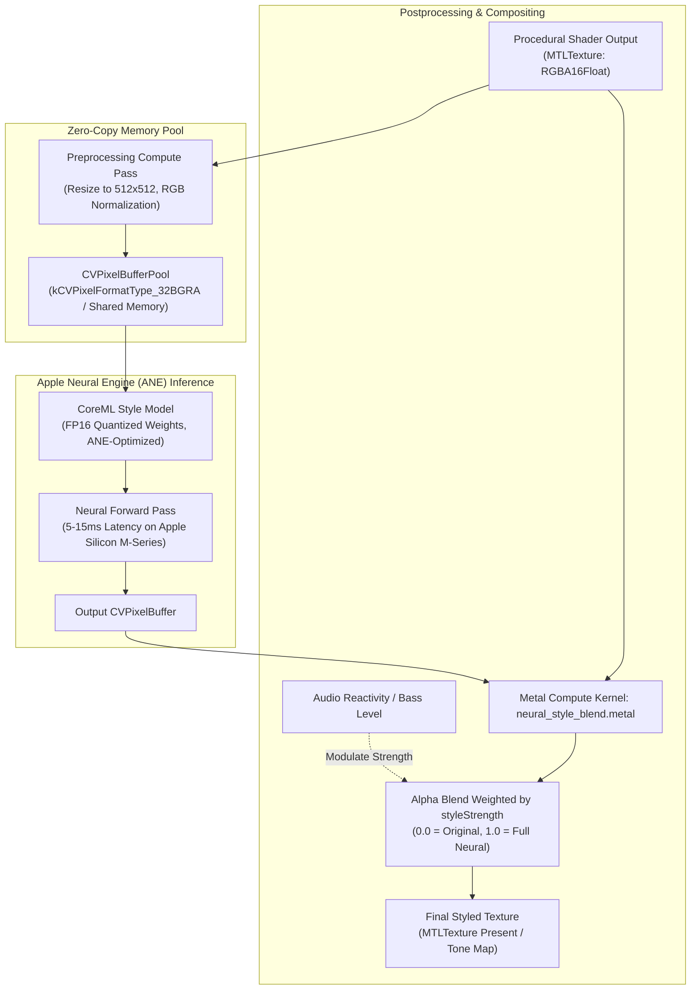

# Neural Effects & CoreML Style Transfer Guide

## Overview

ShaderCandy integrates Apple's CoreML and the Apple Neural Engine (ANE) to perform real-time neural style transfer on procedural shaders. This system transforms procedural geometry and raymarched fractals into artistic imagery inspired by legendary painters and modern aesthetics.

---

## Processing Pipeline



---

## Key Features

- **10 Built-In Artistic Styles**: Van Gogh, Monet, Picasso, Hokusai, Mondrian, Cyberpunk, Oil Painting, Watercolor, Sketch, and Vintage.
- **Hardware Acceleration**: Low-power, low-latency inference executed on the Apple Neural Engine (ANE) and Metal Performance Shaders (MPS).
- **Dynamic Style Blending**: Continuous adjustment of artistic intensity (`0.0` – `1.0`) in real time.
- **Audio-Reactive Stylization**: Neural style strength dynamically driven by bass and spectral flux.
- **Zero-Copy Architecture**: Double-buffered `CVPixelBufferPool` eliminates CPU-to-GPU memory copies.
- **Custom Model Import**: Support for custom user-trained CoreML models (`.mlmodel` / `.mlmodelc`).

---

## Built-In Style Models

### Classical Art Styles

| Style | Aesthetic & Technique | Recommended Shaders |
| :--- | :--- | :--- |
| **Starry Night** | Van Gogh's expressive impasto and swirling celestial patterns | `nebula`, `plasma`, `mandelbulb_3d` |
| **Monet** | Impressionist dappled light, broken color brushstrokes | `deep_ocean_pulse`, `flower`, `aurora` |
| **Picasso** | Cubist fragmentation and multi-perspective geometry | `mandelbox`, `voronoi_cells`, `metaballs` |
| **Hokusai** | Traditional Japanese woodblock print with dramatic line art | `wave`, `seascape`, `mountain_stream` |
| **Oil Painting** | Rich, textured pigments with natural canvas grain | `fractal_pyramid`, `raymarch_sculpture` |
| **Watercolor** | Soft, translucent pigment bleeding and edge fringing | `smoke`, `clouds`, `pastel_unicorns` |
| **Sketch** | High-contrast graphite cross-hatching and contour pencil lines | `wireframe_tunnel`, `grid_landscape` |

### Modern Aesthetics

| Style | Aesthetic & Technique | Recommended Shaders |
| :--- | :--- | :--- |
| **Cyberpunk** | High-contrast neon glows, electric cyan/magenta color grading | `synthwave`, `matrix_rain`, `cyber_city` |
| **Mondrian** | Bold primary colors bounded by thick rectilinear black grids | `geometric_cubes`, `hypercube_4d` |
| **Vintage** | 1970s film stock, warm color bias, halation, subtle grain | `retro_sun`, `cassette_tape` |

---

## Objective-C API Reference

### Initialization & Style Loading

```objc
#import "NeuralStyleEngine.h"

// Retrieve singleton coordinator
NeuralStyleEngine *engine = [NeuralStyleEngine sharedEngine];
NSError *error = nil;
[engine initializeWithDevice:device error:&error];

// Load specific model
[engine loadStyleNamed:@"starry_night" error:&error];
```

### Frame Execution

```objc
// Apply style to active frame
id<MTLTexture> styledTexture = [engine applyStyle:sceneTexture
                                    commandBuffer:commandBuffer
                                         strength:0.75f];
```

### Audio Reactivity Coupling

```objc
// Modulate style intensity based on audio bass level
float currentBass = audioAnalyzer.bassLevel; // 0.0 - 1.0
engine.styleStrength = 0.3f + 0.7f * currentBass;
```

---

## Custom Model Training & Import

### Requirements

| Specification | Requirement |
| :--- | :--- |
| **Input Dimensions** | $512 \times 512$ RGB image tensor |
| **Output Dimensions**| $512 \times 512$ RGB image tensor |
| **Color Space** | sRGB Normalized $[0.0, 1.0]$ or $[-1.0, 1.0]$ |
| **Model Format** | Compiled CoreML (`.mlmodelc`) or source model (`.mlmodel`) |
| **Quantization** | FP16 precision recommended for maximum ANE performance |

### Loading Custom Models

```swift
// Swift custom model loading
let customModelURL = Bundle.main.url(forResource: "my_custom_style", withExtension: "mlmodelc")!
let customModel = StyleTransferModel(name: "CustomStyle", modelURL: customModelURL)
try customModel.load()
```

---

## Performance Benchmarks

| Device | Resolution | Inference Engine | Frame Time | Sustained FPS |
| :--- | :--- | :--- | :--- | :--- |
| **Apple M3 Max** | $512 \times 512$ | Apple Neural Engine (ANE) | 4.2 ms | 60 FPS |
| **Apple M2** | $512 \times 512$ | Apple Neural Engine (ANE) | 7.8 ms | 60 FPS |
| **Apple M1** | $512 \times 512$ | Apple Neural Engine (ANE) | 11.5 ms | 60 FPS |
| **Intel Mac (AMD Vega)**| $512 \times 512$ | Metal Performance Shaders | 28.0 ms | 30 FPS |

---

## Troubleshooting

### High Memory Usage
- **Cause**: Retaining multiple loaded models in VRAM simultaneously.
- **Fix**: Call `[engine unloadCurrentModel]` before loading a new style model.

### Style Latency Stutters
- **Cause**: JIT model compilation on first frame inference.
- **Fix**: Call `[engine prewarmModel]` during application launch or shader transition.
