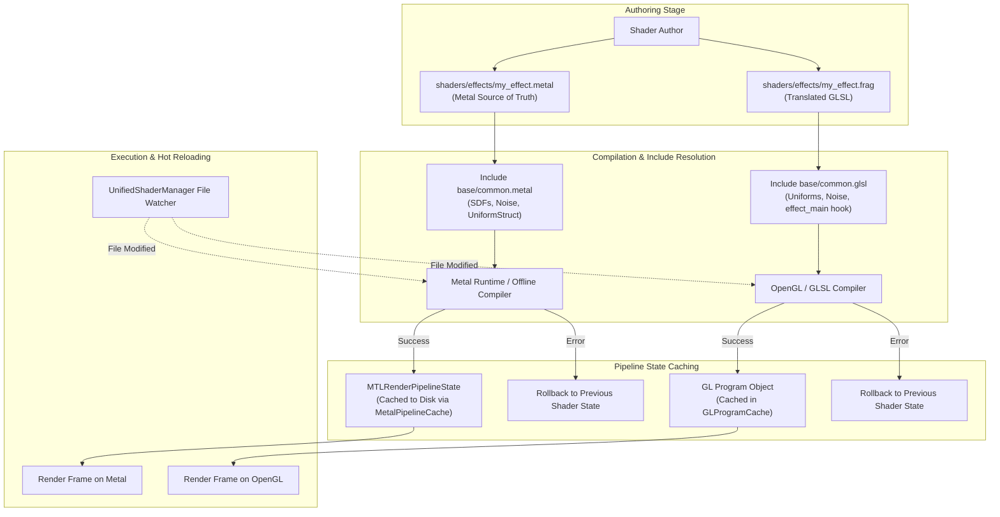

# Shader Authoring & Translation Guide

This comprehensive guide covers how to author new shaders for ShaderCandy and translate shaders between Apple Metal (macOS) and GLSL (Linux/OpenGL).

---

## Table of Contents

1. [Overview & Architecture](#overview--architecture)
2. [Shader Compilation Lifecycle](#shader-compilation-lifecycle)
3. [Creating Your First Shader](#creating-your-first-shader)
4. [Metal vs. GLSL Translation Standards](#metal-vs-glsl-translation-standards)
   - [Type Mappings](#type-mappings)
   - [Function Signatures & Entry Points](#function-signatures--entry-points)
   - [Uniform Access Patterns](#uniform-access-patterns)
   - [Built-In Functions & Differences](#built-in-functions--differences)
   - [Coordinate Systems & Aspect Ratio](#coordinate-systems--aspect-ratio)
   - [Texture Sampling](#texture-sampling)
5. [Shared Utility Library](#shared-utility-library)
   - [Noise Functions (Value, Simplex, FBM)](#noise-functions)
   - [Signed Distance Functions (SDFs)](#signed-distance-functions-sdfs)
   - [Math & Raymarching Helpers](#math--raymarching-helpers)
6. [Best Practices for High Performance](#best-practices-for-high-performance)
7. [Step-by-Step Porting Checklist](#step-by-step-porting-checklist)
8. [Complete Translation Example](#complete-translation-example)
9. [Validation, Testing & Hot Reloading](#validation-testing--hot-reloading)

---

## Overview & Architecture

ShaderCandy supports two native shading languages:
- **Metal Shading Language (MSL)** (`.metal`): Native to macOS, compiled at runtime or ahead-of-time via `metal` and cached with `MTLBinaryArchive`. Metal shaders serve as the **source of truth** for effect design.
- **OpenGL Shading Language (GLSL)** (`.frag` / `.glsl`): Standard `#version 330 core` or `#version 450` fragment shaders for Linux X11 and Wayland sessions.

Both backends share identical uniform layouts, noise algorithms, raymarching solvers, and mathematical constants to guarantee visual parity across platforms.

---

## Shader Compilation Lifecycle



---

## Creating Your First Shader

Shaders reside in the `shaders/` directory:
- `shaders/effects/` for general visual effects, fractals, and raymarched scenes.
- `shaders/music/` for audio-reactive shaders synchronized to frequency bands.

### 1. Basic Metal Shader (`.metal`)

```metal
// shaders/effects/my_effect.metal
#include "../base/common.metal"

fragment float4 fragment_main(
    VertexOut in [[stage_in]],
    constant Uniforms &uniforms [[buffer(0)]]
) {
    // Aspect-corrected NDC coordinates (-1 to 1)
    float2 uv = in.texCoord * 2.0 - 1.0;
    uv.x *= uniforms.resolution.x / uniforms.resolution.y;

    float t = uniforms.time * uniforms.speed;
    float3 color = float3(0.5 + 0.5 * sin(uv.x * 5.0 + t),
                          0.5 + 0.5 * sin(uv.y * 5.0 + t * 1.2),
                          0.5 + 0.5 * cos(t));

    return float4(color * uniforms.intensity, uniforms.alpha);
}
```

### 2. Basic GLSL Shader (`.frag`)

```glsl
// shaders/effects/my_effect.frag
#include "../base/common.glsl"

vec4 effect_main(vec2 centered, vec2 uv) {
    // centered is already aspect-corrected (-1 to 1)
    float t = time * speed;
    vec3 color = vec3(0.5 + 0.5 * sin(centered.x * 5.0 + t),
                      0.5 + 0.5 * sin(centered.y * 5.0 + t * 1.2),
                      0.5 + 0.5 * cos(t));

    return vec4(color * intensity, alpha);
}
```

---

## Metal vs. GLSL Translation Standards

### Type Mappings

| Concept | Metal Type | GLSL Type | Notes |
| :--- | :--- | :--- | :--- |
| **Scalars** | `float`, `int`, `uint`, `bool` | `float`, `int`, `uint`, `bool` | Direct mapping |
| **Half Precision** | `half`, `half2`, `half3`, `half4` | `float`, `vec2`, `vec3`, `vec4` | Upcast to standard float in GLSL |
| **2D Vectors** | `float2`, `int2`, `uint2`, `bool2` | `vec2`, `ivec2`, `uvec2`, `bvec2` | Standard vector representations |
| **3D Vectors** | `float3`, `int3`, `uint3`, `bool3` | `vec3`, `ivec3`, `uvec3`, `bvec3` | Standard vector representations |
| **4D Vectors** | `float4`, `int4`, `uint4`, `bool4` | `vec4`, `ivec4`, `uvec4`, `bvec4` | Standard vector representations |
| **Matrices** | `float2x2`, `float3x3`, `float4x4` | `mat2`, `mat3`, `mat4` | Column-major indexing in both |
| **2D Texture** | `texture2d<float>` | `sampler2D` | Handled via uniform bindings |
| **Sampler** | `sampler` | N/A | Combined in GLSL `sampler2D` |

---

### Function Signatures & Entry Points

#### Metal Entry Point
In Metal, the fragment shader receives the interpolated rasterizer outputs and uniform buffers via attributes:
```metal
fragment float4 fragment_main(
    VertexOut in [[stage_in]],
    constant Uniforms &uniforms [[buffer(0)]],
    constant AudioData &audio [[buffer(1)]] // optional
)
```

#### GLSL Entry Point
In GLSL, `common.glsl` provides the boilerplate `main()` function which sets up coordinate spaces and passes control to `effect_main`:
```glsl
#include "../base/common.glsl"

vec4 effect_main(vec2 centered, vec2 uv) {
    // Return final RGBA color
    return vec4(color, 1.0);
}
```

---

### Uniform Access Patterns

In Metal, uniforms are accessed through the `uniforms.` struct member. In GLSL, uniforms are declared as global variables in `common.glsl` and accessed directly without any prefix:

| Uniform Variable | Metal Access | GLSL Access | Description |
| :--- | :--- | :--- | :--- |
| **Time** | `uniforms.time` | `time` | Elapsed seconds |
| **Resolution** | `uniforms.resolution` | `resolution` | Viewport dimensions in pixels (`vec2`) |
| **Delta Time** | `uniforms.deltaTime` | `deltaTime` | Frame interval in seconds |
| **Frame Counter**| `uniforms.frame` | `frame` | Total frames rendered |
| **Mouse State** | `uniforms.mouse` | `mouse` | XY position + button state |
| **Speed Scale** | `uniforms.speed` | `speed` | User playback speed multiplier |
| **Intensity** | `uniforms.intensity` | `intensity` | Effect brightness/amplitude |
| **Alpha** | `uniforms.alpha` | `alpha` | Surface opacity |
| **Audio Bass** | `uniforms.bass` / `audio.bassLevel` | `bass` | Low-frequency energy (0.0 - 1.0) |
| **Audio Mid** | `uniforms.mid` / `audio.midLevel` | `mid` | Mid-frequency energy (0.0 - 1.0) |
| **Audio Treble**| `uniforms.treble` / `audio.trebleLevel` | `treble` | High-frequency energy (0.0 - 1.0) |
| **Audio Beat** | `uniforms.beat` | `beat` | Beat pulse trigger (1.0 on beat) |

---

### Built-In Functions & Differences

Most math functions (`sin`, `cos`, `tan`, `pow`, `exp`, `log`, `sqrt`, `abs`, `min`, `max`, `clamp`, `mix`, `step`, `smoothstep`, `length`, `normalize`, `dot`, `cross`, `reflect`) are identical. The table below lists functions requiring translation:

| Operation | Metal (MSL) | GLSL | Notes |
| :--- | :--- | :--- | :--- |
| **Saturate** | `saturate(x)` | `clamp(x, 0.0, 1.0)` | Clamps value between 0.0 and 1.0 |
| **Reciprocal Sqrt**| `rsqrt(x)` | `inversesqrt(x)` | $1 / \sqrt{x}$ |
| **Floating Modulo**| `fmod(x, y)` | `mod(x, y)` | Note sign difference on negative values |
| **Conditional Select**| `select(a, b, condition)` | `condition ? b : a` | Component-wise conditional selection |
| **Fractal Part** | `fract(x)` | `fract(x)` | Identical behavior |
| **Matrix Mult** | `m * v` | `m * v` | Both use column vectors |

---

### Coordinate Systems & Aspect Ratio

To ensure identical framing and avoid aspect-ratio distortion:

#### Metal UV Setup
```metal
// Convert [0, 1] texture coordinates to [-1, 1] centered coordinates
float2 centered = in.texCoord * 2.0 - 1.0;
// Correct for non-square aspect ratio
centered.x *= uniforms.resolution.x / uniforms.resolution.y;
```

#### GLSL UV Setup
In GLSL, `centered` is pre-computed by `common.glsl` and passed directly into `effect_main`:
- `centered`: Aspect-corrected Normalized Device Coordinates ($[-aspect, aspect] \times [-1, 1]$). Ideal for raymarching and geometric effects.
- `uv`: Standard $[0, 1]$ texture coordinates. Ideal for 2D post-processing and texturing.

---

### Texture Sampling

#### Metal
```metal
texture2d<float> sourceTexture [[texture(0)]];
constexpr sampler linearSampler(coord::normalized, filter::linear, address::repeat);

float4 sample = sourceTexture.sample(linearSampler, uv);
```

#### GLSL
```glsl
uniform sampler2D sourceTexture;

vec4 sample = texture(sourceTexture, uv);
```

---

## Shared Utility Library

Both `shaders/base/common.metal` and `shaders/base/common.glsl` provide battle-tested procedural algorithms.

### Noise Functions

```metal
// 2D Value Noise
float n = ShaderUtils::noise(float2(x, y));

// 3D Simplex Noise
float s = ShaderUtils::snoise(float3(x, y, z));

// 6-Octave Fractal Brownian Motion (FBM)
float f = ShaderUtils::fbm(float2(x, y));
```

GLSL equivalent:
```glsl
float n = noise(vec2(x, y));
float s = snoise(vec3(x, y, z));
float f = fbm(vec2(x, y));
```

### Signed Distance Functions (SDFs)

```metal
// Primitives
float sphereSDF(float3 p, float radius);
float boxSDF(float3 p, float3 bounds);
float torusSDF(float3 p, float2 radius);
float cylinderSDF(float3 p, float height, float radius);

// Boolean Combinations
float opUnion(float d1, float d2)        { return min(d1, d2); }
float opIntersection(float d1, float d2) { return max(d1, d2); }
float opSubtraction(float d1, float d2)  { return max(-d1, d2); }
float opSmoothUnion(float d1, float d2, float k) {
    float h = clamp(0.5 + 0.5 * (d2 - d1) / k, 0.0, 1.0);
    return mix(d2, d1, h) - k * h * (1.0 - h);
}
```

### Math & Raymarching Helpers

```metal
// Construct camera ray direction with target look-at
float3 getRayDirection(float2 uv, float3 eye, float3 target, float fov);

// 2D and 3D Rotation matrices
float2x2 rotate2D(float angle);
float3x3 rotateX(float angle);
float3x3 rotateY(float angle);
float3x3 rotateZ(float angle);

// Palette generator (Inigo Quilez formula)
float3 palette(float t, float3 a, float3 b, float3 c, float3 d) {
    return a + b * cos(6.28318 * (c * t + d));
}
```

---

## Best Practices for High Performance

1. **Avoid Dynamic Branching**: Divergent branches inside pixel loops kill GPU SIMD occupancy. Replace `if-else` statements with `mix()`, `step()`, or `clamp()`.
2. **Limit Raymarch Iterations**: Keep raymarch step counts bounded (typically 64–128 steps max). Terminate early if `t > maxDist` or `d < epsilon`.
3. **Precompute Constant Invariants**: Compute trigonometric constants and inverse projections outside loops.
4. **Use Vector Operations**: Replace scalar arithmetic with vector operations (`simd_float3`, `vec3`) to maximize ALU utilization.
5. **Respect Aspect Ratio**: Always multiply horizontal coordinates by aspect ratio ($width / height$) to prevent oval distortion on ultra-wide screens.

---

## Step-by-Step Porting Checklist

When translating a Metal shader (`.metal`) to GLSL (`.frag`):

1. **Create Target File**: Create `shaders/effects/<name>.frag`.
2. **Add Header**: Place `#include "../base/common.glsl"` on line 1.
3. **Change Function Signature**: Replace `fragment float4 fragment_main(...)` with `vec4 effect_main(vec2 centered, vec2 uv)`.
4. **Remove Metal Attributes**: Delete all `[[stage_in]]`, `[[buffer(0)]]`, and `[[position]]` declarations.
5. **Convert Types**: Convert `float2/3/4` to `vec2/3/4`, and `float2x2/3x3/4x4` to `mat2/3/4`.
6. **Strip Uniform Prefix**: Change all occurrences of `uniforms.<var>` to `<var>` (e.g. `uniforms.time` $\rightarrow$ `time`).
7. **Replace Coordinates**: Use `centered` for aspect-corrected NDC, and `uv` for 0–1 texture coordinates.
8. **Fix Math Functions**: Replace `saturate(x)` with `clamp(x, 0.0, 1.0)`, and `rsqrt(x)` with `inversesqrt(x)`.
9. **Validate Syntax**: Validate with `glslangValidator -S frag <name>.frag`.
10. **Test in Player**: Launch `./shadercandy-player -shader <name>` to visually verify parity.

---

## Complete Translation Example

### Original Metal (`shaders/effects/plasma.metal`)

```metal
#include "../base/common.metal"

fragment float4 fragment_main(VertexOut in [[stage_in]],
                             constant Uniforms &uniforms [[buffer(0)]]) {
    float2 uv = in.texCoord * 2.0 - 1.0;
    uv.x *= uniforms.resolution.x / uniforms.resolution.y;
    float t = uniforms.time * uniforms.speed * 0.5;

    float v = sin(uv.x * 10.0 + t);
    v += sin(uv.y * 10.0 + t * 1.2);
    v += sin((uv.x + uv.y) * 10.0 + t * 0.8);
    v += sin(length(uv) * 10.0 + t * 1.5);
    v *= 0.25;

    float3 color = float3(
        0.5 + 0.5 * sin(v * 3.14159 + t),
        0.5 + 0.5 * sin(v * 3.14159 + t + 2.0),
        0.5 + 0.5 * sin(v * 3.14159 + t + 4.0)
    );

    color *= uniforms.intensity;
    return float4(color, uniforms.alpha);
}
```

### Translated GLSL (`shaders/effects/plasma.frag`)

```glsl
#include "../base/common.glsl"

vec4 effect_main(vec2 centered, vec2 uv) {
    float t = time * speed * 0.5;

    float v = sin(centered.x * 10.0 + t);
    v += sin(centered.y * 10.0 + t * 1.2);
    v += sin((centered.x + centered.y) * 10.0 + t * 0.8);
    v += sin(length(centered) * 10.0 + t * 1.5);
    v *= 0.25;

    vec3 color = vec3(
        0.5 + 0.5 * sin(v * 3.14159 + t),
        0.5 + 0.5 * sin(v * 3.14159 + t + 2.0),
        0.5 + 0.5 * sin(v * 3.14159 + t + 4.0)
    );

    color *= intensity;
    return vec4(color, alpha);
}
```

---

## Validation, Testing & Hot Reloading

### 1. Compile-Time Validation

Validate Metal shaders:
```bash
xcrun -sdk macosx metal -c my_effect.metal -o /dev/null
```

Validate GLSL fragment shaders:
```bash
glslangValidator -S frag my_effect.frag
```

### 2. Automated Test Suite
Run the internal compilation and regression test suite:
```bash
./build/shadercandy-test --run "Shader Compilation Tests"
```

### 3. Hot-Reloading in Development
ShaderCandy continuously monitors shader files for changes:
1. Launch the standalone player: `./build/shadercandy-player -shader my_effect`
2. Modify `shaders/effects/my_effect.frag` or `my_effect.metal` in your code editor.
3. Save the file. The engine instantly detects the timestamp update, recompiles the pipeline, and swaps the shader state seamlessly with zero frame drops.
