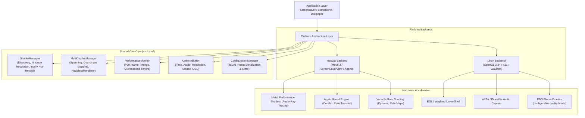

# ShaderCandy: Master Plan & Architecture

**Last Updated:** September 20, 2026

## Executive Summary

ShaderCandy is a high-performance, cross-platform procedural graphics engine and screensaver ecosystem. It provides native GPU-accelerated rendering across macOS (Metal) and Linux (OpenGL 3.3+/4.5, X11, and Wayland). The project features a library of 110+ procedural shaders spanning fractals, raymarched volumetric phenomena, audio-reactive spectrums, and particle simulations.

---

## Core Architecture

### 1. Cross-Platform Engine Design
Platform-independent business logic resides in `src/core/`, governing uniform structures, performance metrics, JSON preset serialization, display canvas spanning, and shader catalog resolution.
- **macOS Backend**: Native Metal implementation integrating with `ScreenSaverView` for screensavers, `NSWindow`/`MTKView` for the standalone player, and `WallpaperEngine` for live desktop backgrounds.
- **Linux Backend**: Modern OpenGL 3.3+ implementation with native X11 windowing, XScreenSaver extension, Wayland compositor layer-shell integration, inotify-based hot reloading, and FBO bloom post-processing.

### 2. Shader Framework & Abstraction
Shaders share a common mathematical and algorithmic foundation across platforms:
- `shaders/base/common.metal`: Metal utilities including 2D/3D noise, Simplex noise, Fractal Brownian Motion (FBM), Raymarching primitives, and SDF combinations.
- `shaders/base/common.glsl`: Direct GLSL equivalents, ensuring visual parity across backends.
- `GLSLWrapper`: Recursive `#include` resolver with mtime-based file caching for fast shader compilation.

### 3. SIMD Optimization
Runtime CPU math dispatch automatically leverages ARM NEON on Apple Silicon and AVX2 on x86_64, with portable scalar fallbacks for universal compatibility.

### 4. Note on Vulkan Backend
A Vulkan backend was previously explored for Linux HDR swapchains (`VK_KHR_swapchain`, `VK_EXT_swapchain_colorspace`). However, following architectural evaluation and contributor clarity audits, Vulkan support was retired. OpenGL 3.3+/4.5 paired with native Wayland and X11 provides full performance parity, lower driver overhead, and maximum stability across Linux distributions.

---

## Feature Status Matrix

| Feature | macOS (Metal) | Linux (OpenGL) | Status |
| :--- | :---: | :---: | :--- |
| **Core Rendering Pipeline** | ✅ | ✅ | Production Ready |
| **Shader Library (110+ Shaders)** | ✅ | ✅ | Production Ready (3D Raymarching & Music Overhaul) |
| **Hot-Reloading System** | ✅ | ✅ | Production Ready (inotify File Watcher + Rollback) |
| **Screensaver Integration** | ✅ | ✅ | Production Ready (macOS, X11, Wayland) |
| **Standalone Player** | ✅ | ✅ | Production Ready (Windowed, Fullscreen, Multi-Display) |
| **Wallpaper Desktop Mode** | ✅ | ✅ | Production Ready (`WallpaperEngine` / `xwinwrap`) |
| **Multi-Display Spanning** | ✅ | ✅ | Production Ready (`MultiDisplayManager`, `HeadlessRenderer`) |
| **Audio Reactivity (FFT)** | ✅ | ✅ | Production Ready (AVFoundation / ALSA + FFTW3) |
| **Audio Utils** | N/A | ✅ | Production Ready (packAudioForShader, getDominantFrequency, getSpectralCentroid, bandHasEnergy) |
| **JSON Configuration & Presets** | ✅ | ✅ | Production Ready (Dynamic Presets & Persistence) |
| **Screenshot Capture & OSD** | ✅ | ✅ | Production Ready (Universal Hotkeys) |
| **Compute-Based Bloom** | ✅ | ✅ | Production Ready on Metal (Tile Memory); FBO-based on Linux (configurable blur passes) |
| **Variable Rate Shading (VRS)** | ✅ | ❌ | Production Ready on Metal (Dynamic Rate Maps) |
| **Persistent PSO Disk Cache** | ✅ | ❌ | Production Ready on Metal (`MetalPipelineCache`) |
| **HDR (10-bit / EDR)** | ✅ | ✅ | Production Ready on macOS (EDR); FBO bloom + tone mapping on Linux |
| **Headless Rendering** | ✅ | ✅ | Offscreen FBO + ffmpeg video encoding (PNG/JPG/PPM) |
| **Uniform Upload** | Metal buffer bindings | ✅ | UniformUploader with cached location dispatch; uploads ShaderParams and audioData[256]; null-guard for headless |
| **Neural Effects (CoreML)** | ✅ | ❌ | macOS-Only (Apple Neural Engine / Metal) |
| **Ray-Traced Audio (MPS)** | ✅ | ❌ | macOS-Only (Metal Performance Shaders) |
| **Transition System** | ❌ | ✅ | 10 transition types + 10 easing functions (`GLRendererTypes.h`) |
| **Post-Processing Config** | ❌ | ✅ | Vignette, chromatic aberration, film grain, CRT scanlines, color tint |
| **Adaptive Quality** | ❌ | ✅ | Dynamic resolution scaling to maintain target FPS |
| **Smart Shader Rotation** | ❌ | ✅ | Shuffle, favorites/skip lists, auto-rotate with configurable duration |

---

## Recently Completed Milestones

- **Metal Compute Bloom & Dynamic VRS**: Replaced fragment bloom with a tile-based compute shader dispatch using Apple Silicon threadgroup memory, and bound dynamic `MTLRasterizationRateMap` passes to accelerate complex raymarched fractals.
- **Linux FBO Bloom Pipeline**: Configurable quality levels (Low/Medium/High/Ultra) with Gaussian blur passes, threshold extraction, and additive composite via FBO ping-pong rendering.
- **Unified Core ShaderManager**: Implemented `UnifiedShaderManager` in `src/core/ShaderManager.cpp`, featuring recursive directory scanning, `#include` resolution, uniform reflection, and inotify-based hot reloading.
- **Multi-Display Virtual Canvas & Headless Renderer**: Full implementation of `MultiDisplayManager` in `src/core/MultiDisplayManager.cpp` supporting `Single`, `SpanAll`, `Clone`, and `Independent` spanning modes, coordinate mapping, and headless offscreen rendering with ffmpeg video encoding.
- **Microsecond Precision & P99 Timings**: Enhanced `PerformanceMonitor` with microsecond-precision rolling histograms and P99 latency tracking.
- **Spatial Audio MPS Optimization**: Transitioned `AcousticSimulator.mm` to hardware-accelerated ray-tracing using Metal Performance Shaders (`MPSRayIntersector`, `MTLAccelerationStructure`).
- **Persistent Pipeline State Object (PSO) Disk Cache**: Serialized pipeline state caching preventing runtime hitches during shader compilation.
- **Battery-Aware Rendering**: Integrated power source monitoring (`IOPSCopyPowerSourcesInfo`) across macOS player and screensaver modes to throttle frame rates and adjust quality on battery.
- **GLRendererTypes.h & UniformUploader**: Extracted GL-only types for testability; cached uniform location dispatch eliminating redundant `glGetUniformLocation` calls. UniformUploader now uploads ShaderParams (param1-6, colorPalette, effectFlags) and full audioData[256] with null-guard for headless mode.
- **Shader Include Caching**: `GLSLWrapper` with mtime-based file caching for fast `#include` resolution across 52+ fragment shaders.
- **Audio Utils**: `packAudioForShader`, `getDominantFrequency`, `getSpectralCentroid`, `bandHasEnergy` for efficient audio data packing and analysis.
- **Transition System**: 10 transition types (Crossfade, Dissolve, WipeLeft/Right/Up/Down, ZoomIn/Out, SpinClockwise/CounterClockwise) with 10 easing functions (Linear, EaseIn/Out/InOut, Cubic variants, Exponential variants) via `GLTransitionConfig`.
- **Post-Processing Config**: `GLPostProcessConfig` with vignette (intensity, radius), chromatic aberration (amount), film grain (intensity), CRT scanlines (intensity), and color tint (R, G, B) — each independently toggleable.
- **Adaptive Quality**: `GLAdaptiveQualityConfig` dynamically scales resolution to maintain target FPS with configurable min/max resolution scale bounds.
- **Smart Shader Rotation**: Shuffle mode, favorites list, skip list, and auto-rotate with configurable per-shader duration for hands-free browsing.
- **109 Tests, 0 Valgrind Errors**: Comprehensive unit and integration test coverage across 10 suites with verified memory safety.

---

## Roadmap & Future Work

Detailed engineering objectives are maintained in **[nextsteps.md](./nextsteps.md)**. All 8 original roadmap items are now completed, plus additional Linux GL features (transition system, post-processing, adaptive quality, smart rotation). Current focus areas include expanding test coverage, improving documentation, and community distribution channels.

---

## Documentation Index

| Document | Purpose |
| :--- | :--- |
| **[nextsteps.md](./nextsteps.md)** | Active engineering roadmap and keyboard controls reference |
| **[ArchitectureDiagrams.md](./ArchitectureDiagrams.md)** | Visual diagrams of rendering, display spanning, audio, and core pipelines |
| **[ApplicationModesGuide.md](./ApplicationModesGuide.md)** | User guide for Standalone Player, Wallpaper Mode, and Screensaver on macOS and Linux |
| **[ShaderAuthoringGuide.md](./ShaderAuthoringGuide.md)** | Developer guide for creating and translating shaders across Metal and GLSL |
| **[LinuxFeatures.md](./LinuxFeatures.md)** | Linux platform architecture, Wayland/X11 details, and build instructions |
| **[HdrImplementation.md](./HdrImplementation.md)** | Technical specification for 10-bit color, EDR, and tone mapping operators |
| **[NeuralEffectsGuide.md](./NeuralEffectsGuide.md)** | CoreML style transfer engine, built-in styles, and ANE integration (macOS-only) |
| **[shaders.md](./shaders.md)** | Complete catalog of 110+ procedural shaders with features and categories |
| **[release_notes_0_1_0.md](./release_notes_0_1_0.md)** | Release notes for v0.1.0 |
| **[release_notes_0_2_0.md](./release_notes_0_2_0.md)** | Release notes for v0.2.0 |
