# ShaderCandy Shader Gallery

This document provides a complete catalog of all available shaders in ShaderCandy, organized by category.

**Total Shaders:** 64 unique effects
**Platforms:** macOS (Metal), Linux (OpenGL/GLSL)

---

## Table of Contents

- [Music-Reactive Shaders](#music-reactive-shaders) (10 shaders)
- [Visual Effects](#visual-effects) (33 shaders)
- [Character & Creature Shaders](#character--creature-shaders) (18 shaders)
- [Audio Visualization](#audio-visualization) (1 shader)
- [Neural Style Transfer](#neural-style-transfer) (1 shader)
- [Classic Shaders](#classic-shaders) (7 shaders)

---

## Music-Reactive Shaders

These shaders respond to audio input, creating dynamic visuals synchronized to your music.

### 8-Bit
**File:** `music/8bit.metal` / `music/8bit.frag`

Retro 8-bit platformer aesthetic with scrolling clouds, question blocks, coins, enemies, and a castle. Features pixelation effects and CRT scanlines for authentic retro gaming feel.

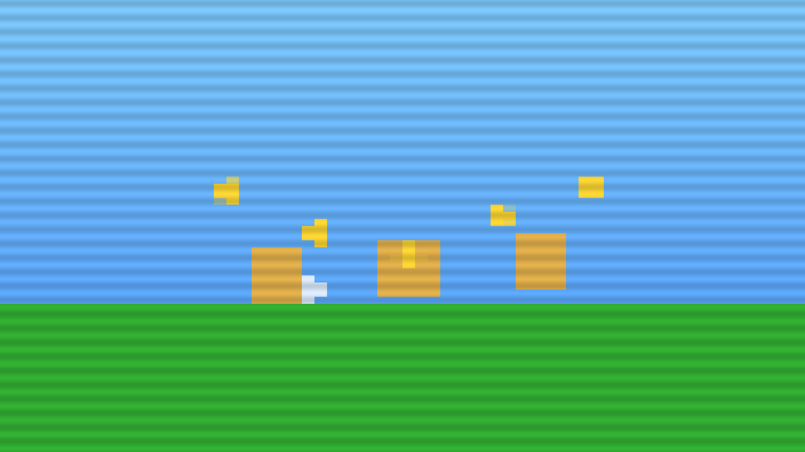

**Features:**
- Scrolling parallax clouds with animated faces
- Bouncing question blocks
- Collectible coins
- Walking enemies (Goomba-style)
- Castle at the end
- CRT scanline effects
- Audio reactivity (bass boost, treble sparkle)

---

### Classical
**File:** `music/classical.metal` / `music/classical.frag`

Elegant flowing ribbons in gold and ivory tones with 3D musical notes and treble clefs floating through space. Perfect for orchestral and classical music.

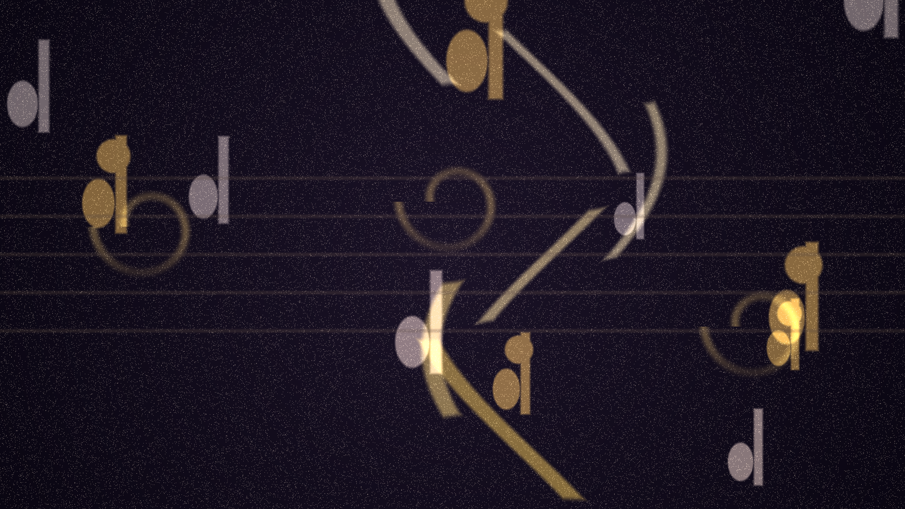

**Features:**
- Flowing ribbon curves
- 3D rendered musical notes
- Treble clef symbols
- Staff lines background
- Gold-to-ivory gradients
- Audio-responsive sparkle effects

---

### Electronic
**File:** `music/electronic.metal` / `music/electronic.frag`

Cyberpunk digital rain aesthetic with grid landscapes and neon pulses. Ideal for EDM, techno, and electronic music.

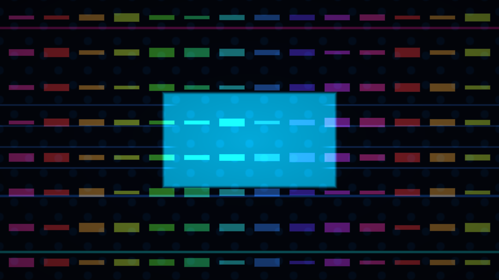

**Features:**
- Matrix-style digital rain
- Neon grid landscapes
- Pulsing beat visualization
- Synthwave color palette

---

### Heavy Metal
**File:** `music/heavymetal.metal` / `music/heavymetal.frag`

Dark industrial theme with fiery effects and aggressive motion. Perfect for metal, rock, and industrial genres.

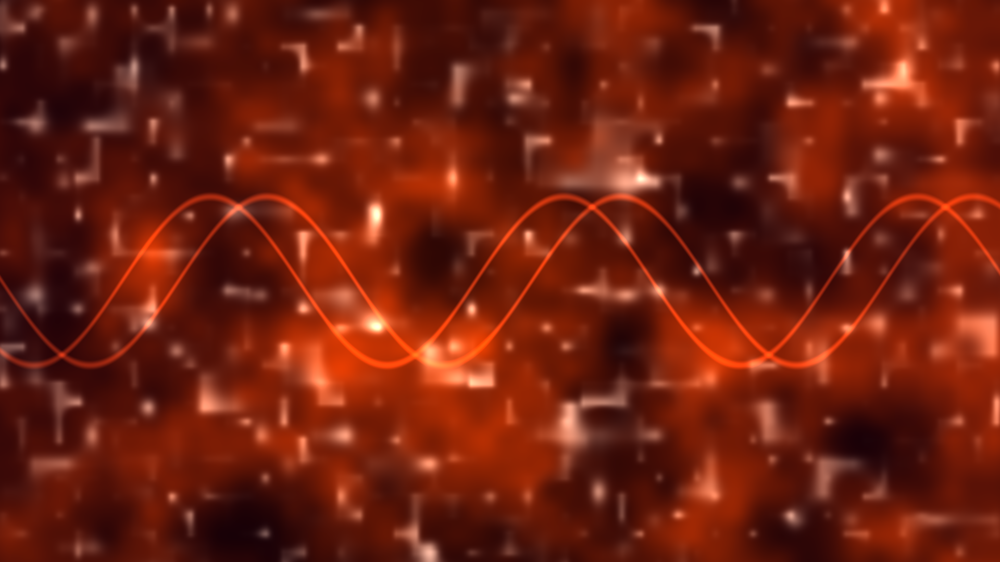

**Features:**
- Industrial aesthetic
- Fire and ember effects
- Aggressive transitions
- Dark color palette

---

### Hip Hop
**File:** `music/hiphop.metal` / `music/hiphop.frag`

Urban graffiti-style visuals with street art influences and rhythmic patterns.

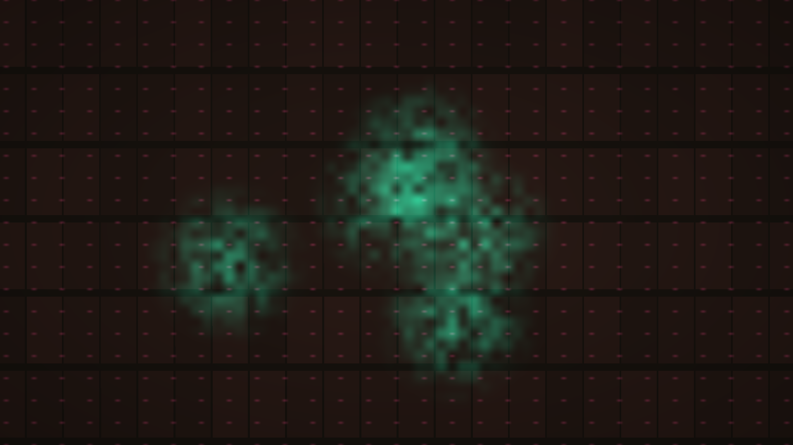

**Features:**
- Graffiti-style elements
- Urban color palette
- Beat-responsive motion

---

### Jazz
**File:** `music/jazz.metal` / `music/jazz.frag`

Smooth flowing patterns inspired by jazz improvisation and liquid motion.

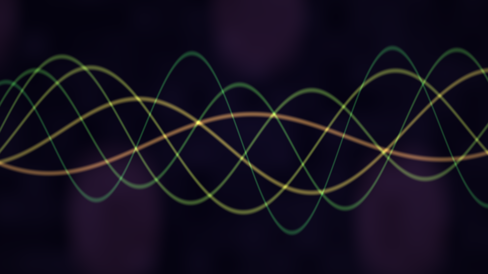

**Features:**
- Smooth flowing curves
- Warm color transitions
- Improvisational motion

---

### Punk
**File:** `music/punk.metal` / `music/punk.frag`

Aggressive glitch aesthetic with distorted visuals and chaotic energy.

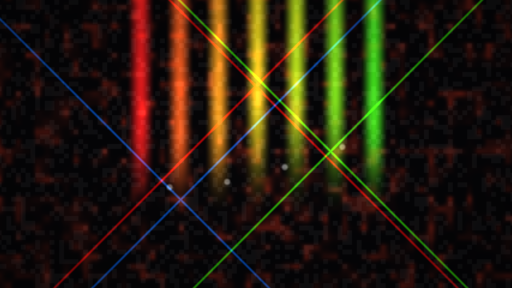

**Features:**
- Glitch effects
- Distorted motion
- High energy transitions
- Raw visual style

---

### Reggae
**File:** `music/reggae.metal` / `music/reggae.frag`

Tropical island vibes with beach sunsets and ocean themes.

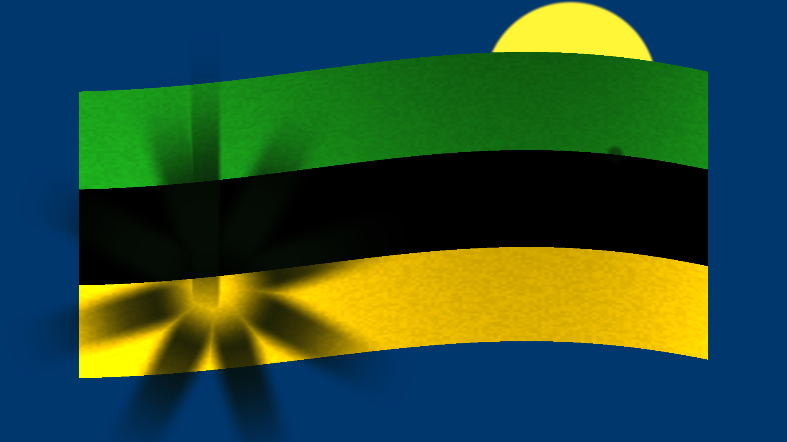

**Features:**
- Tropical colors (green, yellow, red)
- Sunset gradients
- Beach/ocean elements
- Laid-back motion

---

### Soul
**File:** `music/soul.metal` / `music/soul.frag`

Warm flowing gradients with smooth, emotive transitions.

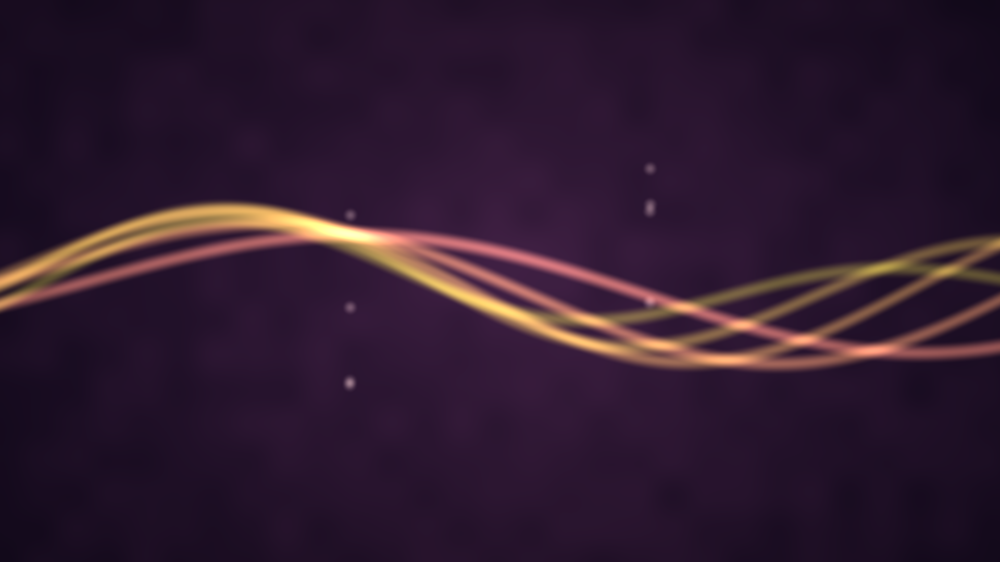

**Features:**
- Warm color palette
- Smooth gradients
- Emotive motion
- Velvet-like textures

---

### Vaporwave
**File:** `music/vaporwave.metal` / `music/vaporwave.frag`

80s retro nostalgia with pink/purple gradients, palm trees, and sunset grids.

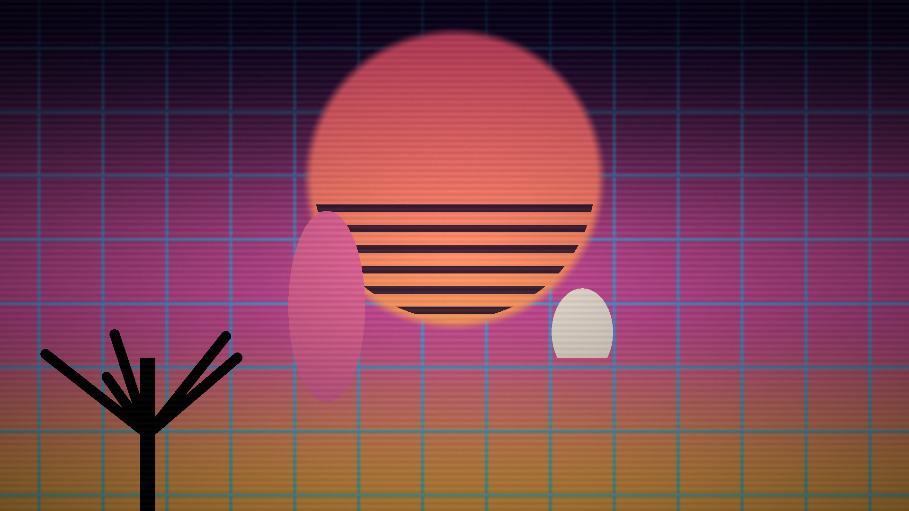

**Features:**
- Synthwave grid landscape
- Pink and purple gradients
- Retro sun
- Palm tree silhouettes
- Scanline effects

---

### Mushroom
**File:** `effects/mushroom.metal`

3D rotating neon rainbow colored mushrooms as particles on a fractal neon background. Features organic mushroom shapes with caps and stalks, rotating on the X-axis at different heights and sizes.

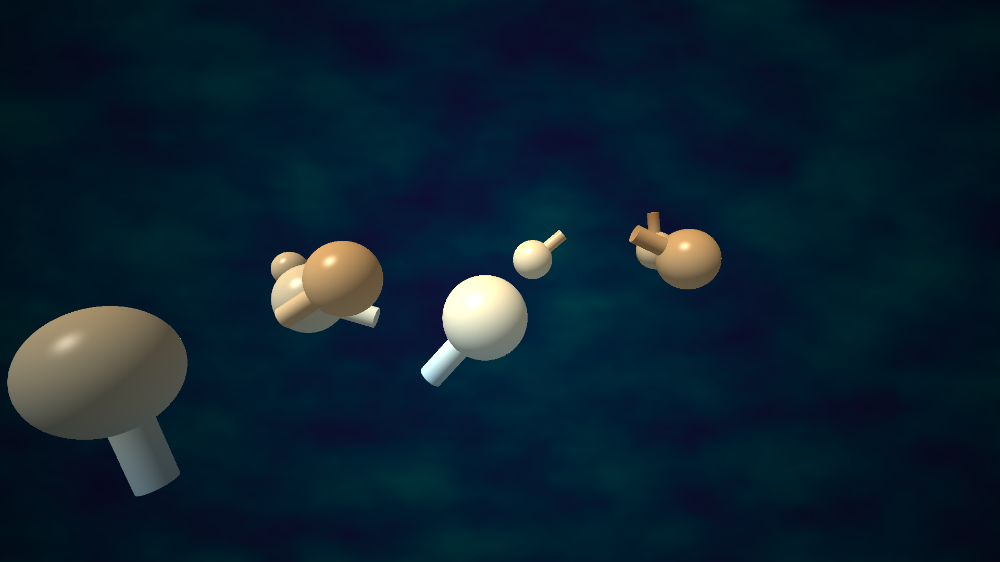

**Features:**
- SDF-based mushroom caps and stalks
- 40 rotating mushroom particles at varied heights
- Fractal neon background using multi-layer noise
- Rainbow color shifting effect over time
- X-axis rotation for each mushroom particle
- Glow effect based on distance field

---

## Visual Effects

### Area 51
**File:** `effects/area_51.metal` / `effects/area_51.frag`

Alien and UFO sighting at a secret desert base with multiple flying saucers, tractor beams, and cows grazing on the ground.

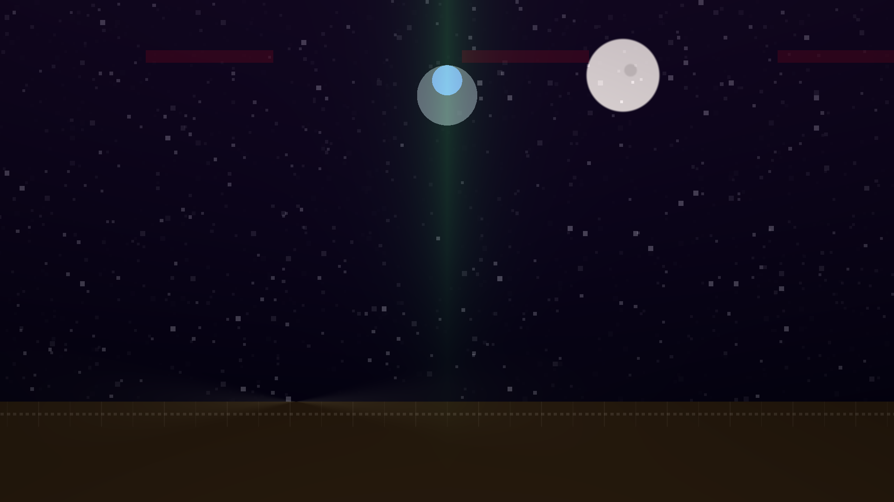

**Features:**
- 3D raymarched UFOs with animated lights
- Tractor beams pulling up cows
- Alien figures walking around
- Moon with craters
- Warning lights and searchlights
- Flickering aurora effects

---

### Astra Fractal
**File:** `effects/astra_fractal.metal` / `effects/astra_fractal.frag`

3D Mandelbox fractal tunnel with psychedelic color shifts, dynamic zoom, and vibrant rainbow colors.

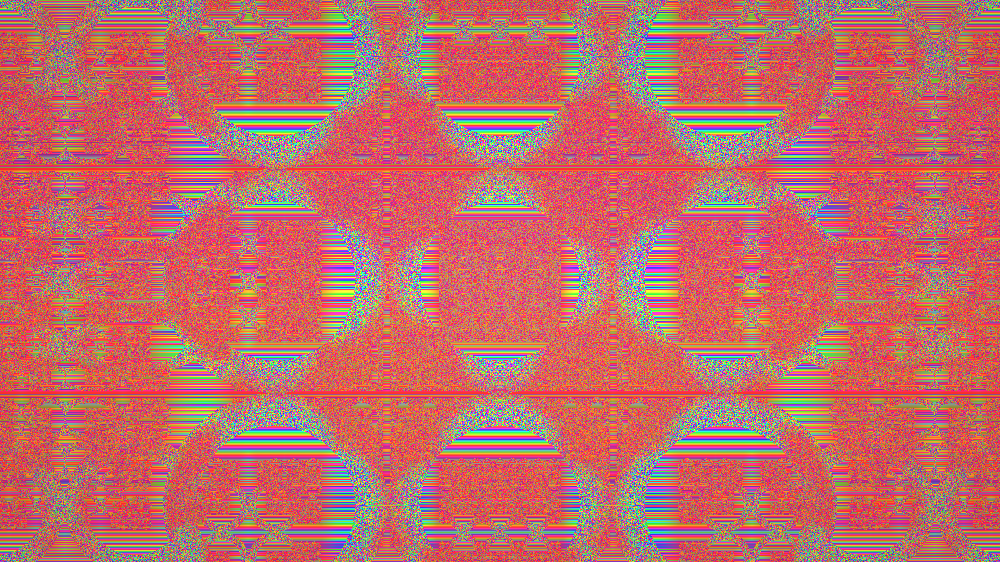

**Features:**
- Mandelbox fractal with Julia set variation
- Dynamic zoom effect (1x to 4x)
- Vibrant rainbow colors
- Starfield background
- Chromatic aberration effects
- Camera rotation through tunnel

---

### Audio Spectrum
**File:** `effects/audio_spectrum.frag`

Real-time frequency analysis visualization with bars responding to different frequency bands.

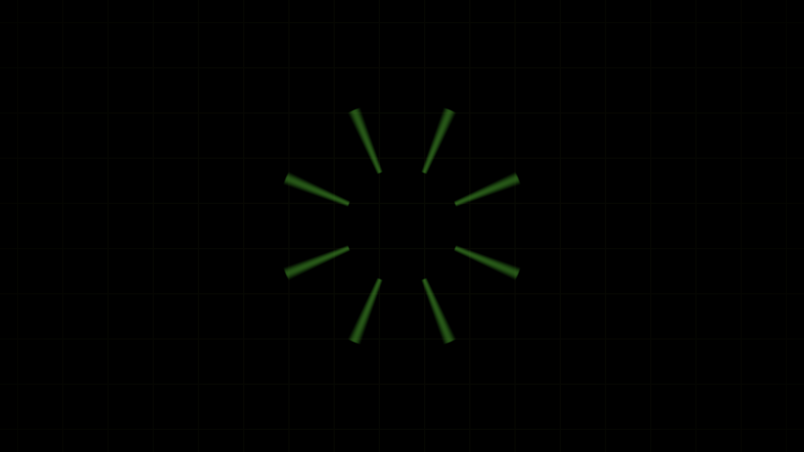

**Features:**
- FFT frequency analysis
- Multiple visualization modes
- Color-coded frequency bands
- Beat detection

---

### Biolume Forest
**File:** `effects/biolume_forest.metal` / `effects/biolume_forest.frag`

Organic glowing mushrooms and vines in a dark void with bioluminescent effects and floating spores.

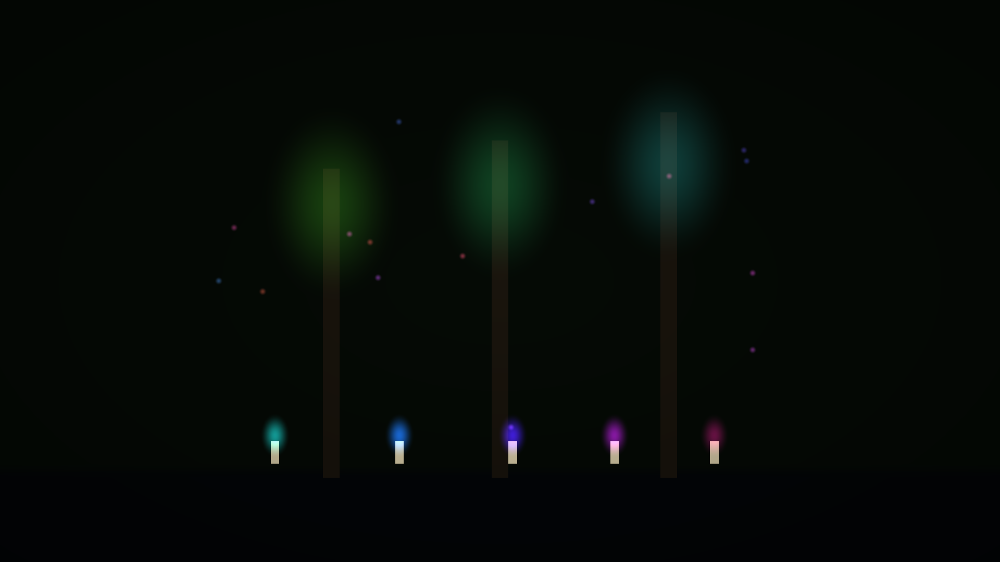

**Features:**
- Procedural mushroom generation
- Glowing caps and stems
- Bioluminescent spores
- Hanging vines
- Firefly particles
- Slow x-axis rotation
- Atmospheric fog

---

### Bloom
**File:** `effects/bloom.frag`

HDR glow effect with high dynamic range lighting simulation.

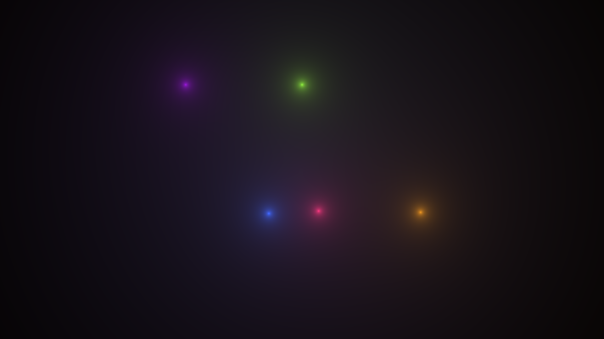

**Features:**
- HDR rendering
- Glow/bloom post-processing
- Light bleed effects
- Adjustable intensity

---

### Calibration
**File:** `effects/calibration.metal` / `effects/calibration.frag`

Test pattern for display setup with color bars, gradients, and geometric patterns.

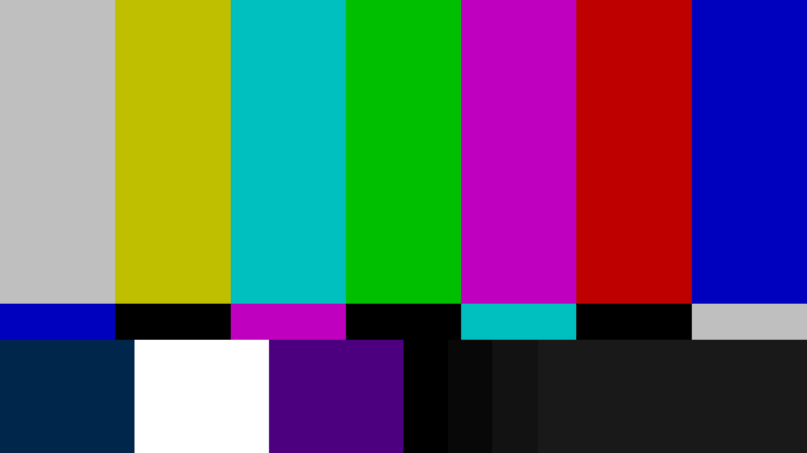

**Features:**
- Color bar test pattern
- Grayscale gradients
- Geometric alignment patterns
- Brightness/contrast reference

---

### Chrono Warp
**File:** `effects/chrono_warp.metal` / `effects/chrono_warp.frag`

Time-distortion tunnel with clock-inspired elements and temporal effects.

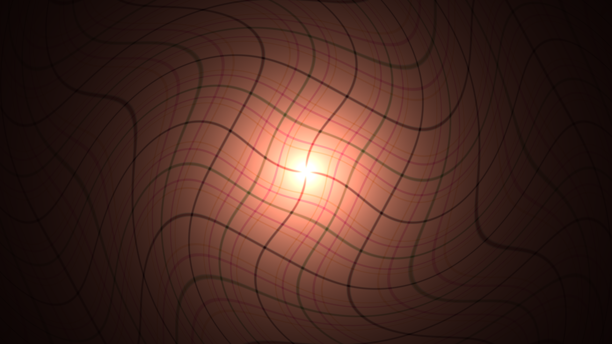

**Features:**
- Clock face elements
- Time-warp distortion
- Temporal color shifts
- Tunnel perspective

---

### Cosmic Kaleido
**File:** `effects/cosmic_kaleido.metal` / `effects/cosmic_kaleido.frag`

Mirror symmetry patterns inspired by kaleidoscopes with cosmic color schemes.

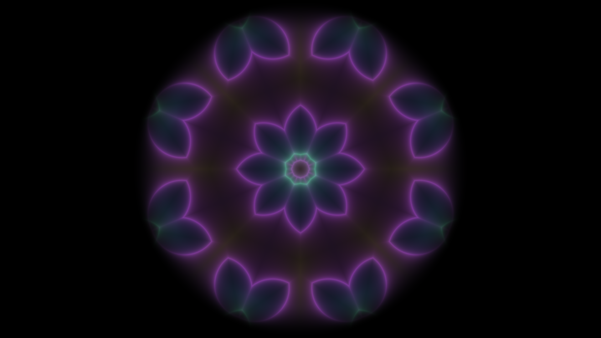

**Features:**
- Mirror symmetry (6-fold)
- Cosmic color palette
- Rotating pattern base
- Smooth transitions

---

### Deep Ocean Pulse
**File:** `effects/deep_ocean_pulse.metal` / `effects/deep_ocean_pulse.frag`

Underwater caustics and bubbles with deep blue color palette and bioluminescent effects.

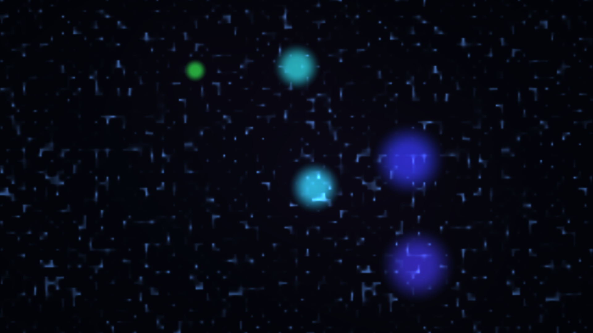

**Features:**
- Caustic light patterns
- Rising bubbles
- Deep blue gradients
- Pulse effects synchronized to audio

---

### Event Horizon
**File:** `effects/event_horizon.metal` / `effects/event_horizon.frag`

Black hole visualization with accretion disk and gravitational lensing effects.

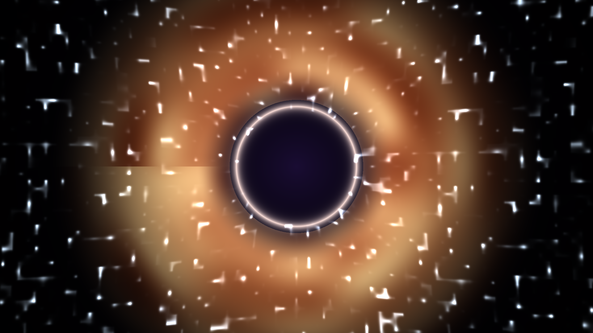

**Features:**
- Black hole silhouette
- Accretion disk
- Gravitational lensing
- Particle jets
- Time dilation effects

---

### Fallout
**File:** `effects/fallout.metal` / `effects/fallout.frag`

Post-apocalyptic wasteland with radioactive effects and decay aesthetics.

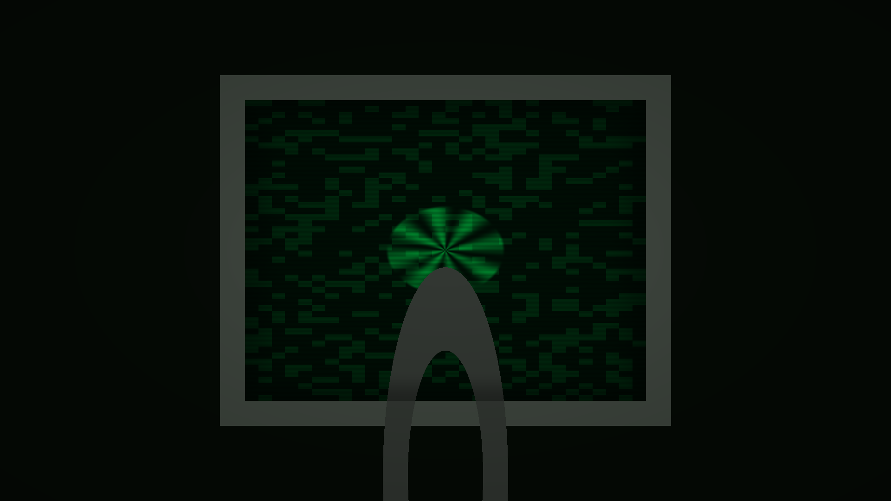

**Features:**
- Radioactive green glow
- Decay textures
- Dust particles
- Ruined structures
- Toxic atmosphere

---

### Fractal Zoom
**File:** `effects/fractal_zoom.metal` / `effects/fractal_zoom.frag`

Infinite Mandelbrot dive with smooth zooming and color cycling.

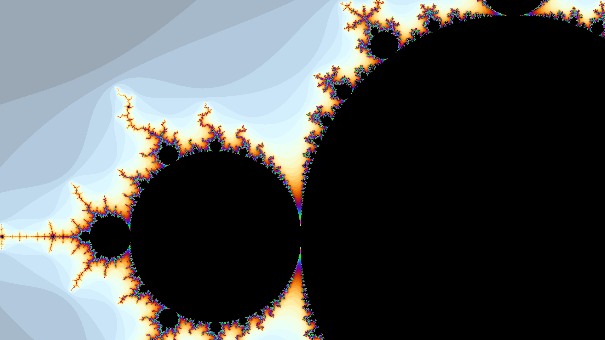

**Features:**
- Deep Mandelbrot zoom
- Smooth navigation
- Color cycling
- Detail preservation

---

### Hearts
**File:** `effects/hearts.metal` / `effects/hearts.frag`

3D floating hearts coming from all directions with romantic atmosphere.

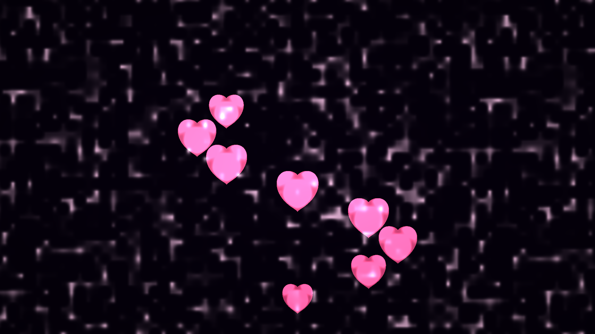

**Features:**
- 3D heart shapes
- Multiple heart streams
- Camera rotation
- Pink and red color palette
- Sparkle effects
- Fog and depth

---

### Julia 3D
**File:** `effects/julia_3d.metal` / `effects/julia_3d.frag`

3D Julia set fractal with complex mathematical visualization.

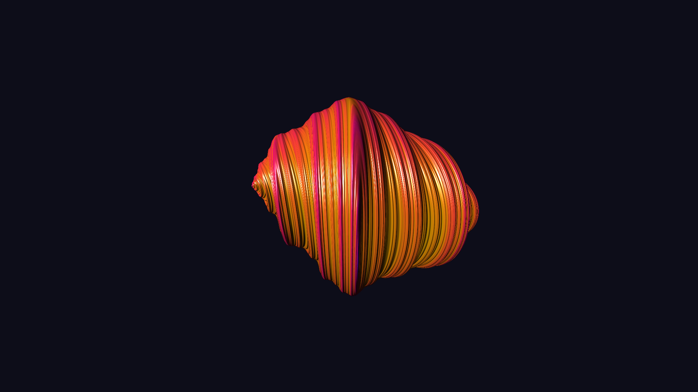

**Features:**
- 3D Julia set
- Quaternion mathematics
- Deep zoom capability
- Smooth coloring

---

### Julia Set
**File:** `effects/julia_set.metal` / `effects/julia_set.frag`

2D Julia set visualization with interactive parameter control.

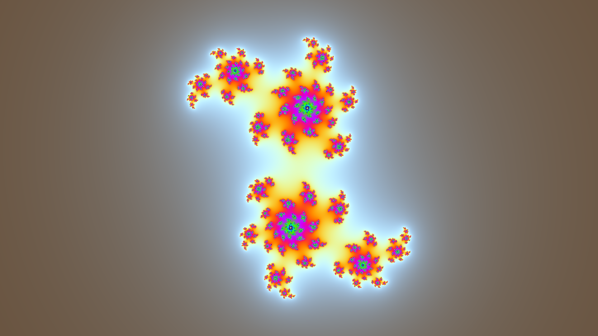

**Features:**
- 2D Julia set
- Interactive parameters
- Smooth gradients
- High precision

---

### Kaleidoscopic Tunnel
**File:** `effects/kaleidoscopic_tunnel.metal` / `effects/kaleidoscopic_tunnel.frag`

Psychedelic tunnel with kaleidoscopic patterns and vibrant colors.

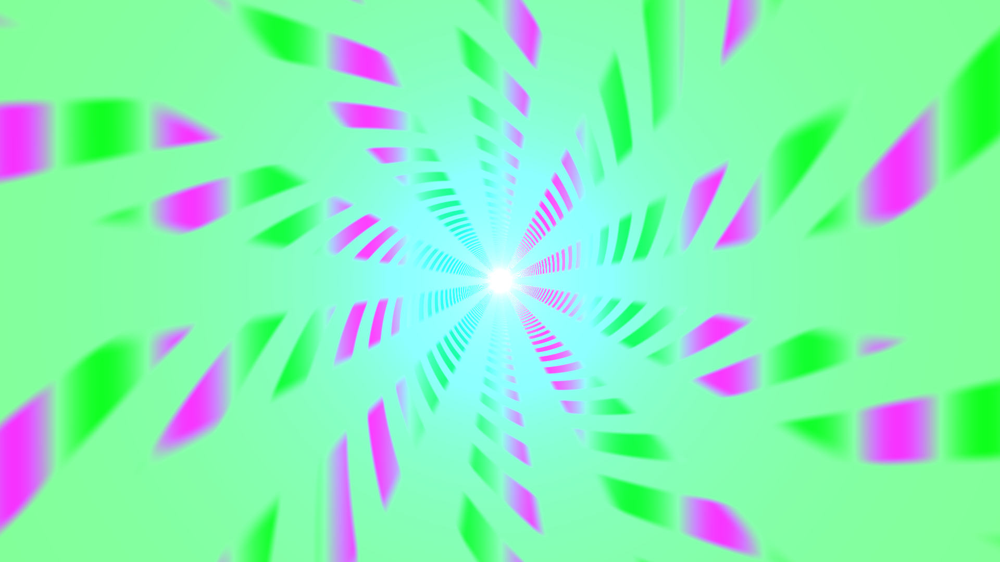

**Features:**
- Tunnel perspective
- Kaleidoscope patterns
- Color cycling
- Rotation effects

---

### Liquid Aura
**File:** `effects/liquid_aura.metal` / `effects/liquid_aura.frag`

Fluid energy simulation with smooth flowing motion and ethereal glow.

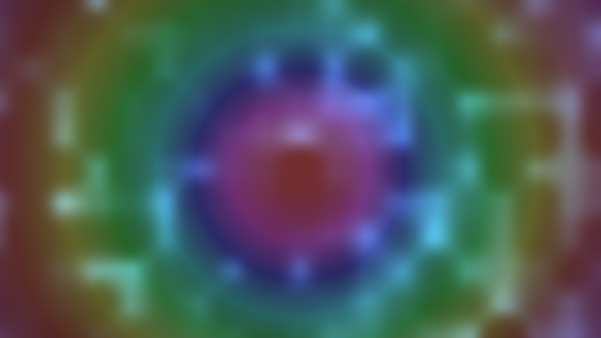

**Features:**
- Fluid dynamics
- Energy flows
- Smooth gradients
- Ethereal glow

---

### Liquid Gradient
**File:** `effects/liquid_gradient.metal` / `effects/liquid_gradient.frag`

Smooth flowing colors with liquid-like motion and organic transitions.

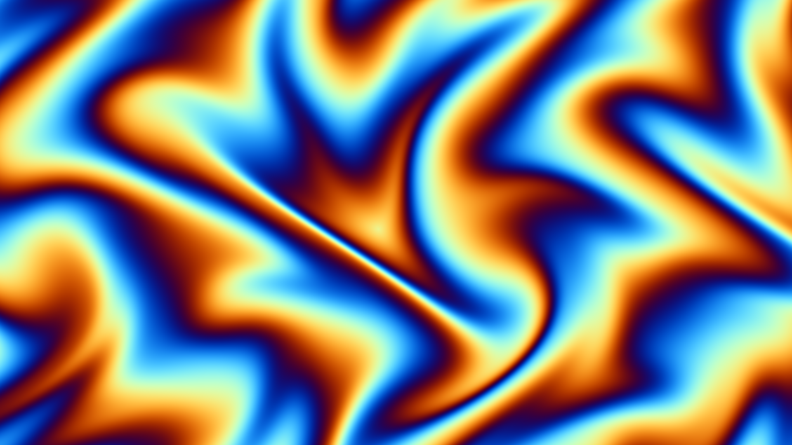

**Features:**
- Smooth color transitions
- Liquid motion
- Organic shapes
- Soft gradients

---

### Mandelbrot Set
**File:** `effects/mandelbrot_set.metal` / `effects/mandelbrot_set.frag`

Classic fractal explorer with deep zoom and smooth coloring.

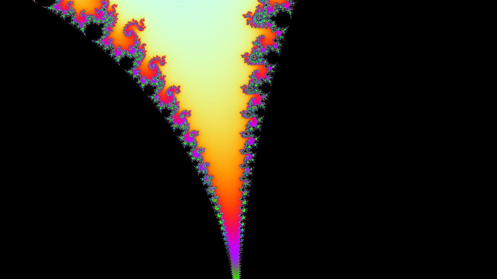

**Features:**
- Deep zoom capability
- Smooth coloring algorithm
- Interactive exploration
- High precision math

---

### Mandelbulb 3D
**File:** `effects/mandelbulb_3d.metal` / `effects/mandelbulb_3d.frag`

3D Mandelbrot set (Mandelbulb) with volumetric rendering.

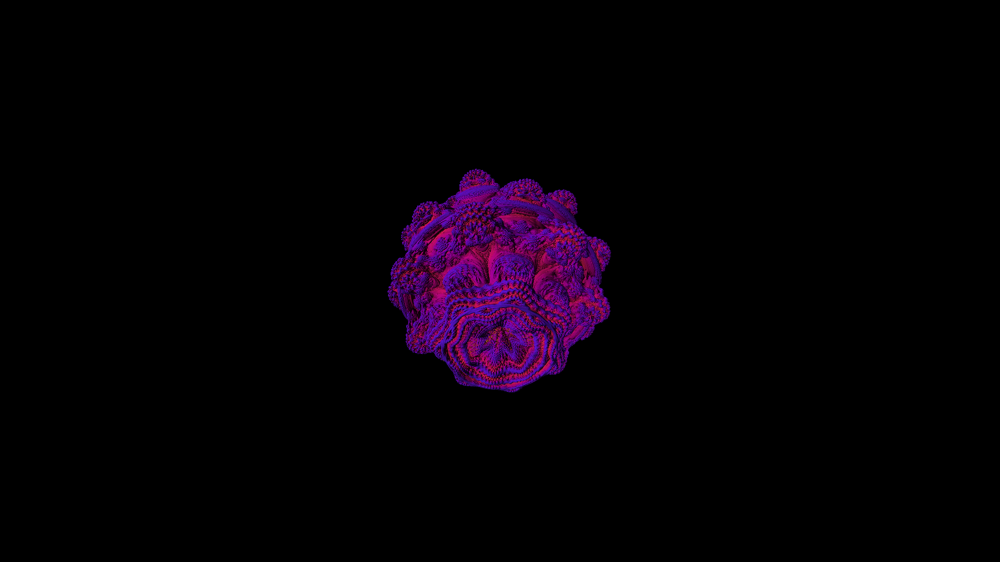

**Features:**
- 3D Mandelbulb fractal
- Volumetric rendering
- Ray marching
- Complex surface detail

---

### Mind Palace
**File:** `effects/mind_palace.metal` / `effects/mind_palace.frag`

Infinite shifting architectural rooms with rotating perspectives and appearing/disappearing cross beams.

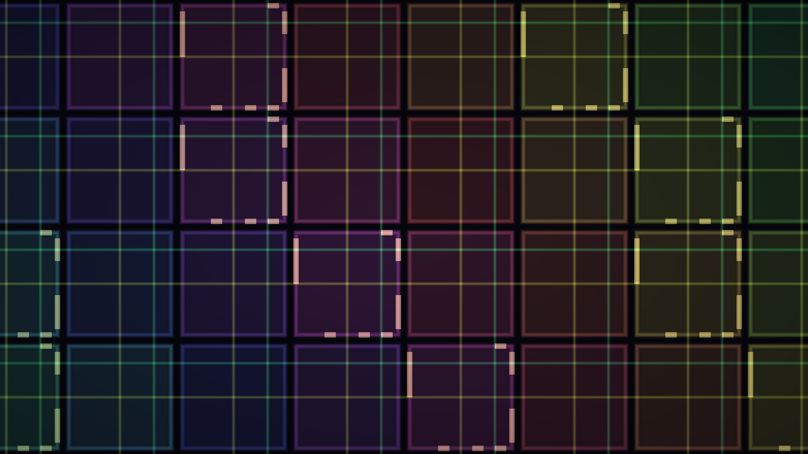

**Features:**
- Architectural structures
- Rotating camera perspectives
- Appearing/disappearing beams
- Glowing hieroglyphs
- Color-shifting patterns
- Multiple light sources

---

### Nebula
**File:** `effects/nebula.metal` / `effects/nebula.frag`

Cosmic gas clouds with volumetric rendering and starfield backdrop.

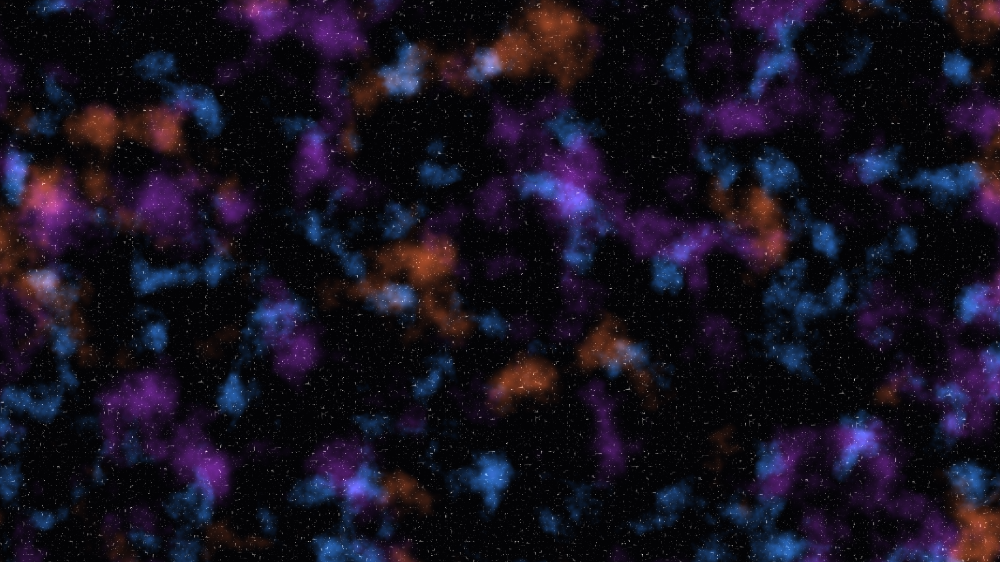

**Features:**
- Volumetric gas clouds
- Starfield background
- Colorful nebula clouds
- Depth layering

---

### Neon Pulse
**File:** `effects/neon_pulse.metal` / `effects/neon_pulse.frag`

Synthwave grid landscape with neon lights and retro aesthetic.

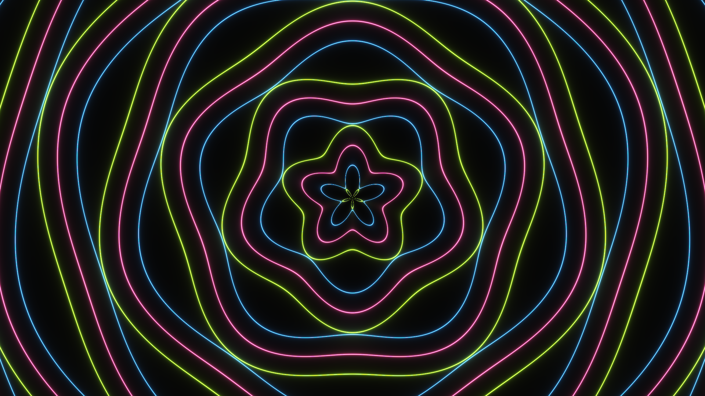

**Features:**
- Retro grid floor
- Neon light strips
- Synthwave aesthetic
- Sunset gradient

---

### Neural Nexus
**File:** `effects/neural_nexus.metal` / `effects/neural_nexus.frag`

AI-inspired network visualization with interconnected nodes and data flows.

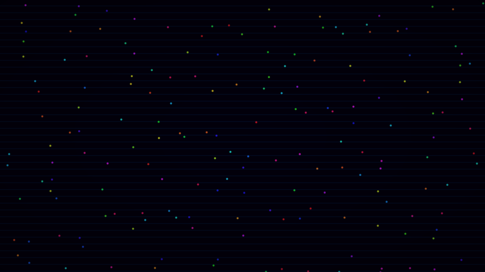

**Features:**
- Network nodes
- Data flow visualization
- AI aesthetic
- Connected pathways

---

### Particles
**File:** `effects/particles.metal` / `effects/particles.frag`

GPU particle system with thousands of interactive particles.

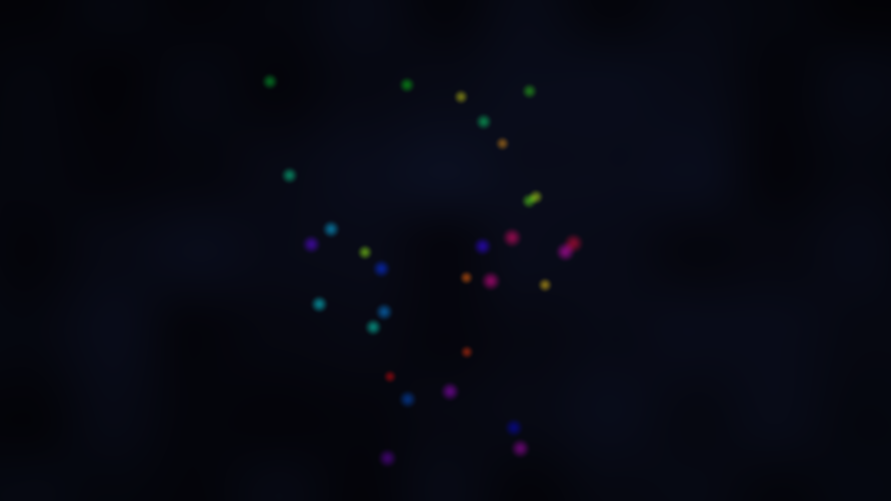

**Features:**
- Thousands of particles
- GPU acceleration
- Interactive forces
- Collision detection

---

### Prism Core
**File:** `effects/prism_core.metal` / `effects/prism_core.frag`

Crystal refraction with light splitting into spectral colors.

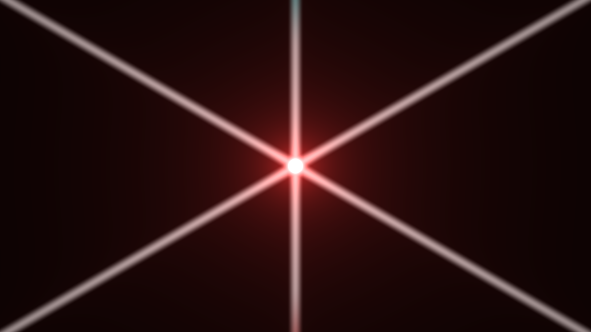

**Features:**
- Crystal geometry
- Light refraction
- Spectral colors
- Transparency effects

---

### Quantum Crystalline
**File:** `effects/quantum_crystalline.metal` / `effects/quantum_crystalline.frag`

Quantum field visualization with crystalline structures and probability waves.

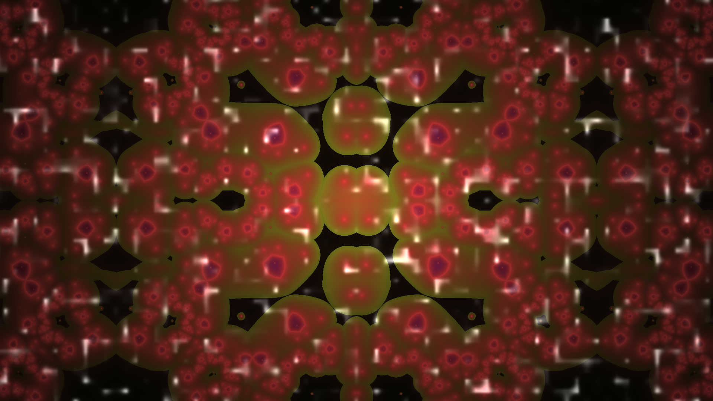

**Features:**
- Crystalline structures
- Probability waves
- Quantum field aesthetic
- Mathematical precision

---

### Reaction Diffusion
**File:** `effects/reaction_diffusion.metal` / `effects/reaction_diffusion.frag`

Chemical pattern formation simulating Gray-Scott reaction-diffusion.

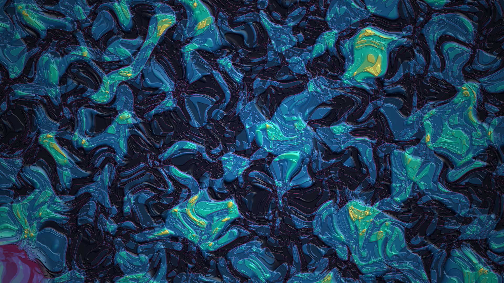

**Features:**
- Gray-Scott model
- Organic patterns
- Chemical simulation
- Evolving structures

---

### Retro Robot
**File:** `effects/retro_robot.metal` / `effects/retro_robot.frag`

Vintage sci-fi aesthetic with robot motifs and retro-futuristic elements.


**Features:**
- Retro sci-fi aesthetic
- Robot motifs
- Vintage color palette
- Mechanical elements

---

### Starfield Warp
**File:** `effects/starfield_warp.metal` / `effects/starfield_warp.frag`

Hyperspace travel effect with stars stretching into light trails.

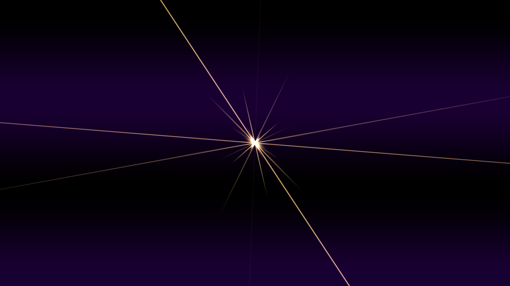

**Features:**
- Starfield generation
- Warp speed effect
- Light trails
- Speed transition

---

### Starship HUD
**File:** `effects/starship_hud.metal` / `effects/starship_hud.frag`

Sci-fi interface elements with targeting systems and ship telemetry.

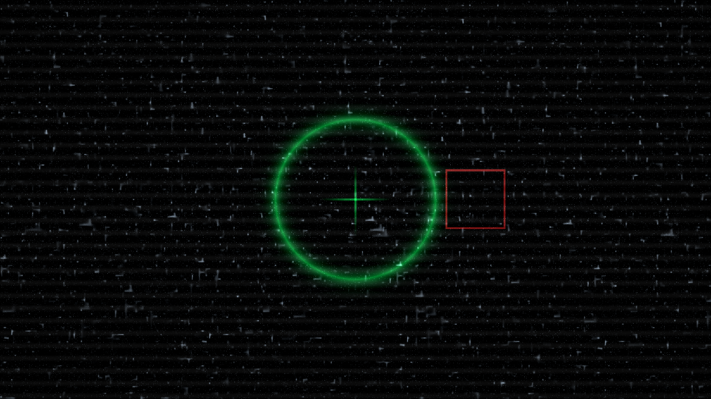

**Features:**
- HUD interface elements
- Targeting systems
- Ship telemetry
- Sci-fi aesthetic

---

### Voronoi Cells
**File:** `effects/voronoi_cells.metal` / `effects/voronoi_cells.frag`

Geometric tessellation with Voronoi diagram patterns.

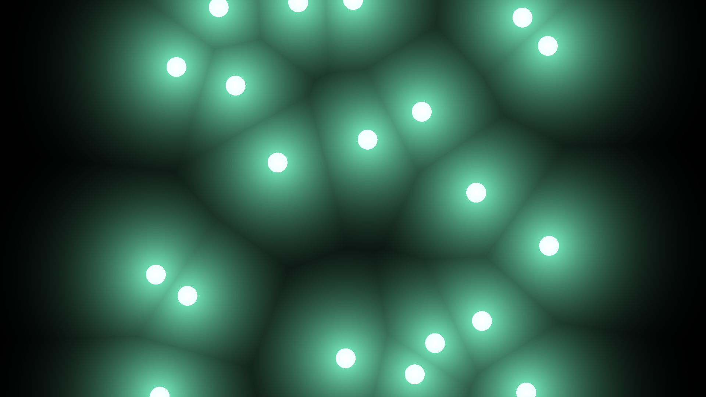

**Features:**
- Voronoi diagram
- Cell borders
- Color gradients
- Animated centers

---

### Vortex Dream
**File:** `effects/vortex_dream.metal` / `effects/vortex_dream.frag`

Swirling color tunnel with hypnotic rotation and smooth gradients.

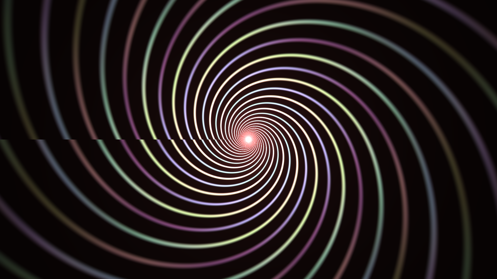

**Features:**
- Vortex/tunnel effect
- Swirling colors
- Hypnotic rotation
- Smooth gradients

---

## Character & Creature Shaders

### Aquatic
**File:** `aquatic.metal` / `aquatic.frag`

Underwater life scene with 3D depth layers, dark blue waves, and fish silhouettes.

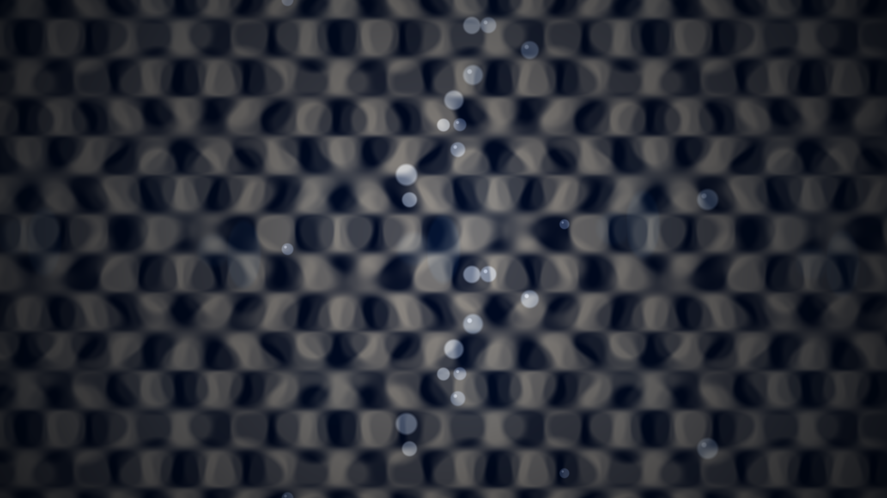

**Features:**
- 3D depth layers (far, middle, near)
- Multiple dark blue wave layers
- Fish silhouettes
- Rising bubbles
- Caustic lighting effects
- Depth-based fog

---

### CapMan
**File:** `capman.metal` / `capman.frag`

Pac-Man style game board with maze walls, dots, and ghosts.

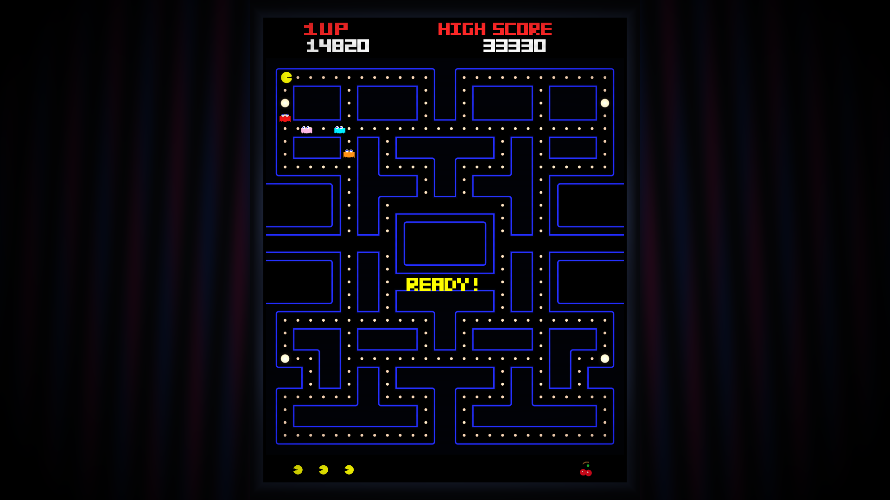

**Features:**
- Authentic Pac-Man maze
- Collectible dots and power pellets
- Four ghosts with unique colors
- Animated Pac-Man with wedge mouth
- Arcade-style lighting

---

### Dragon
**File:** `dragon.metal` / `dragon.frag`

Mystical dragon eye with 3D blinking animation and detailed scales.

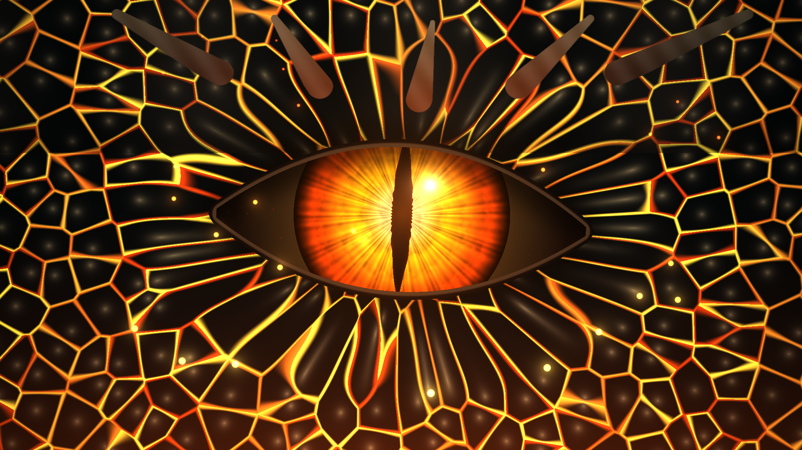

**Features:**
- 3D raymarched eye
- Blinking eyelids animation
- Fiery orange/red iris
- Detailed scales
- Pupil reflection
- Fire particles

---

### Dwarves
**File:** `dwarves.metal` / `dwarves.frag`

Underground forge scene with 3D dwarves working at anvils.

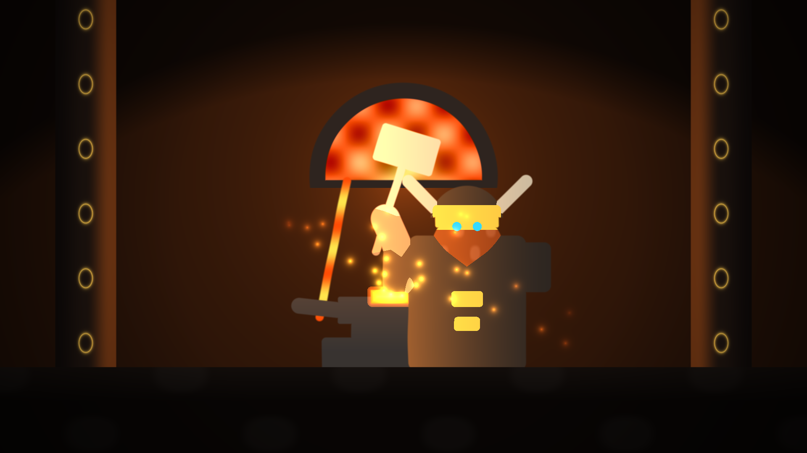

**Features:**
- 3D raymarched dwarves
- Beards and helmets
- Battle axes
- Underground cave
- Forge/furnace with fire
- Stone pillars

---

### Elves
**File:** `elves.metal` / `elves.frag`

Mystical forest elves with pointed ears, bows, and flowing hair.

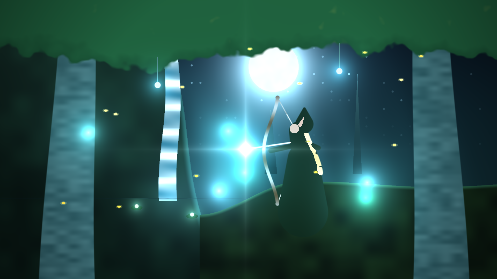

**Features:**
- 3D raymarched elves
- Pointed ears
- Bows and arrows
- Flowing golden hair
- Forest setting with trees
- Magic wisps/fairies

---

### Frog
**File:** `frog.metal` / `frog.frag`

Pond life with lily pad, water ripples, and sun orbit in the sky.


**Features:**
- 3D raymarched frog
- Lily pad platform
- Water ripples
- Sun orbit across sky
- Dynamic sky gradient
- X-axis camera rotation

---

### Knights
**File:** `knights.metal` / `knights.frag`

Medieval battle scene with armored knights and castle backdrop.

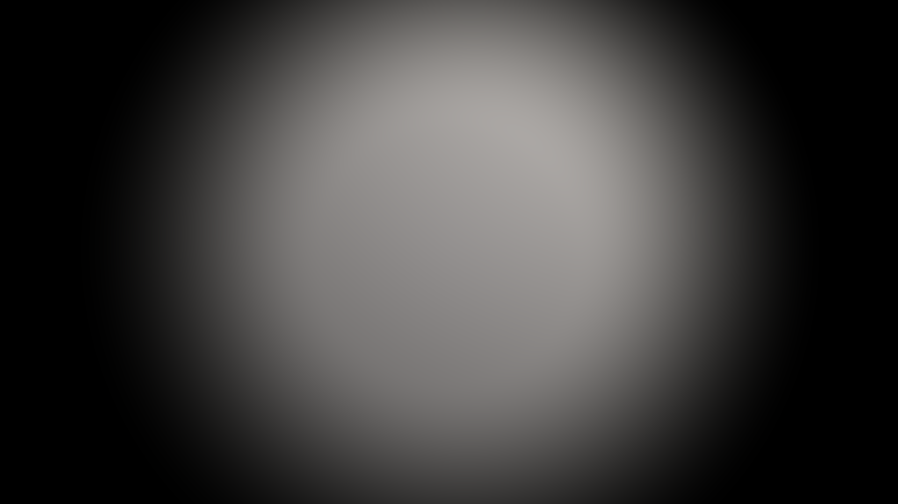

**Features:**
- Armored knights
- Castle architecture
- Battlefield setting
- Medieval atmosphere

---

### Orcs
**File:** `orcs.metal` / `orcs.frag`

Volcanic fortress warriors with 3D orcs, spiked armor, and weapons.

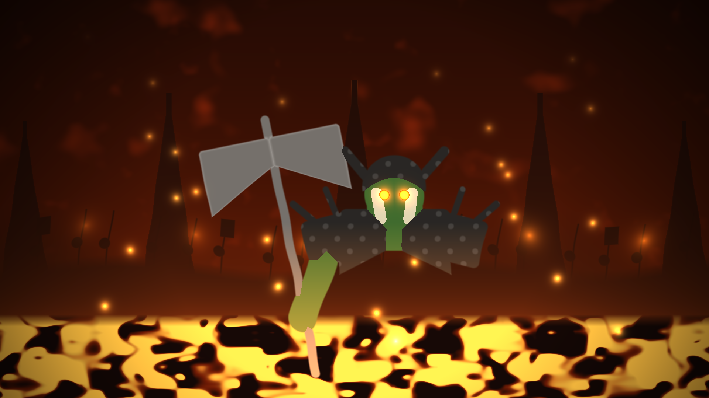

**Features:**
- 3D raymarched orcs
- Muscular bodies
- Tusks and war paint
- Spiked shoulder armor
- Giant battle axes
- Volcanic fortress setting
- Lava flows

---

### Owl
**File:** `owl.metal` / `owl.frag`

Night watch with 3D owls featuring detailed feathers and rotating heads.


**Features:**
- 3D raymarched owls
- Rotating heads
- Facial discs
- Detailed feathers
- Glowing yellow eyes
- Night sky with stars
- Tree branches

---

### Thieves
**File:** `thieves.metal` / `thieves.frag`

Stealth shadow scene with thieves hiding in darkness.

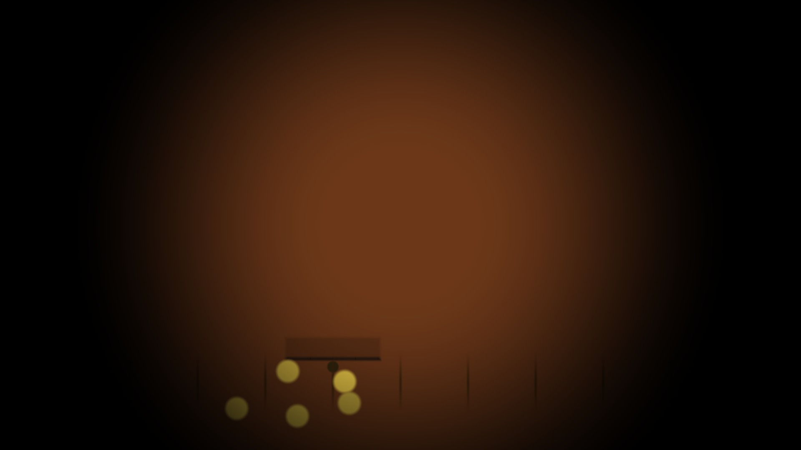

**Features:**
- Stealth aesthetic
- Shadow effects
- Dark color palette
- Hidden figures

---

### Unicorn
**File:** `unicorn.metal` / `unicorn.frag`

Magical creature with flowing rainbow mane and glowing spiral horn.

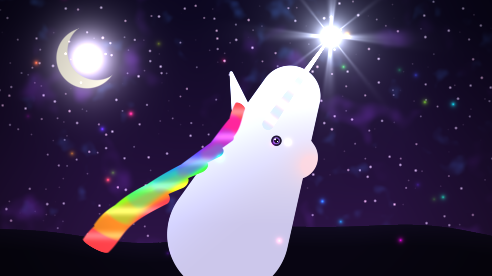

**Features:**
- 3D raymarched unicorn
- Flowing rainbow mane
- Animated tail
- Spiral glowing horn
- Magical particles
- Rainbow lighting effects

---

## Audio Visualization

### Audio Ray Tracing
**File:** `audio/audio_ray_tracing.metal` / `audio/audio_ray_tracing.frag`

Acoustic visualization using ray tracing techniques to show sound propagation.

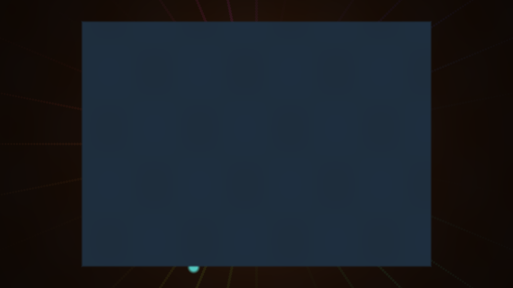

**Features:**
- Ray-traced audio visualization
- Sound wave propagation
- Acoustic simulation
- Real-time frequency response
- 3D spatial audio representation

---

## Neural Style Transfer

### Neural Style Blend
**File:** `neural/neural_style_blend.metal` / `neural/neural_style_blend.frag`

Artistic style transfer using neural networks to blend content and style images.


**Features:**
- Neural network-based style transfer
- Real-time processing
- Multiple style presets
- Adjustable style strength
- Content preservation

---

## Classic Shaders

### Checkerboard
**File:** `checkerboard.frag`

Optical illusion pattern with animated checkerboard.

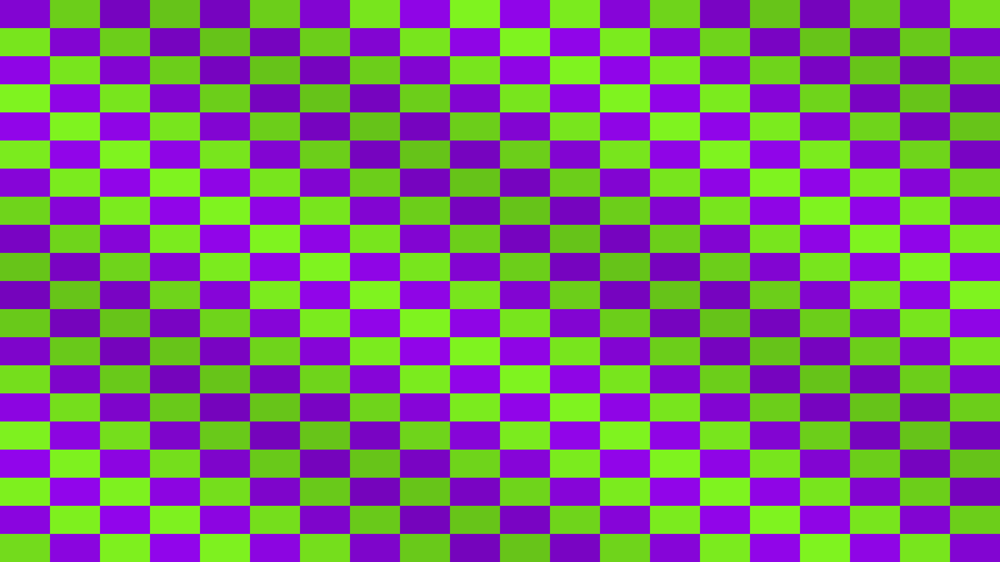

**Features:**
- Animated checkerboard
- Optical illusion effects
- High contrast
- Adjustable speed

---

### Flying Toasters
**File:** `flying_toasters.frag`

After Dark screensaver tribute with flying toasters and toast.

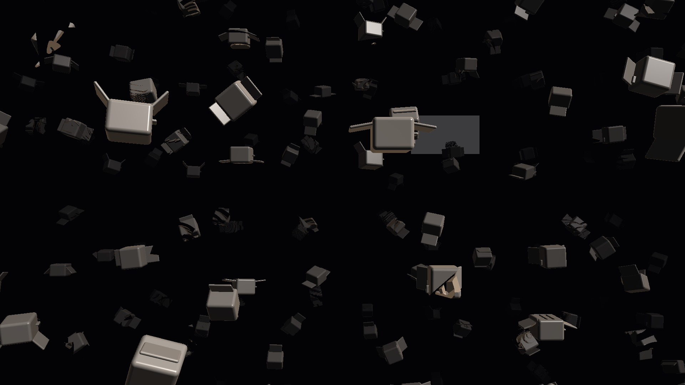

**Features:**
- Flying toasters
- Toast animation
- After Dark tribute
- Retro aesthetic

---

### Gradient Waves
**File:** `gradient_waves.frag`

Smooth flowing colors with wave-like motion.

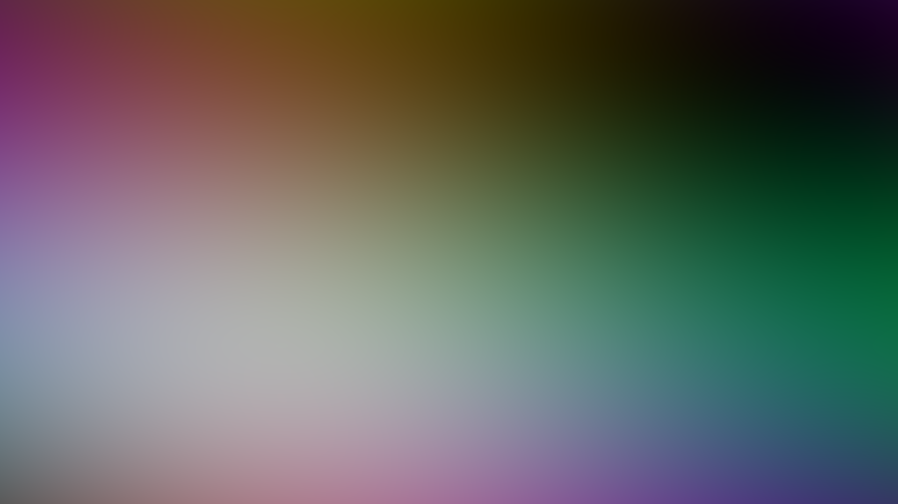

**Features:**
- Smooth gradients
- Wave motion
- Color transitions
- Organic flow

---

### Plasma
**File:** `plasma.frag`

Classic demo scene effect with animated plasma.

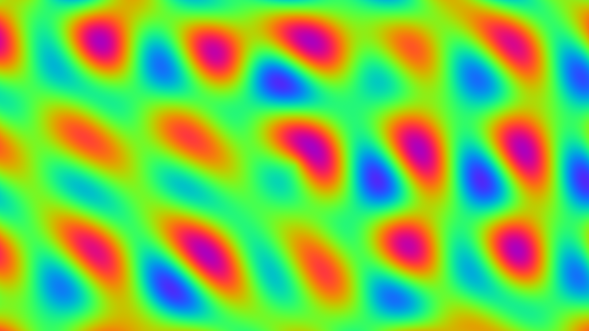

**Features:**
- Classic plasma effect
- Demo scene aesthetic
- Animated colors
- Mathematical patterns

---

### Ripples
**File:** `ripples.frag`

Water ripple simulation with realistic wave propagation.

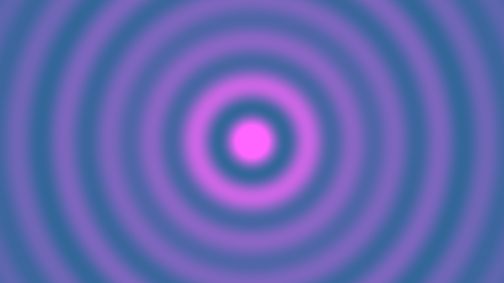

**Features:**
- Water ripple simulation
- Wave propagation
- Interactive drops
- Realistic physics

---

### Spiral
**File:** `spiral.frag`

Hypnotic rotating spiral with color cycling.

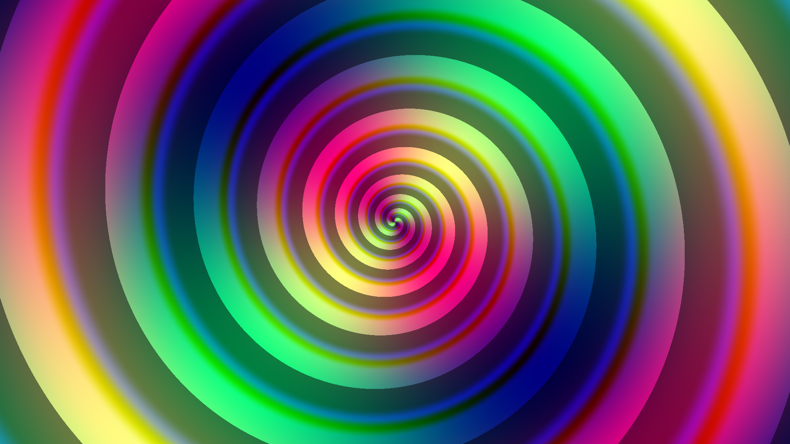

**Features:**
- Rotating spiral
- Color cycling
- Hypnotic motion
- Adjustable speed

---

### Tunnel
**File:** `tunnel.frag`

Infinite corridor effect with perspective and motion.

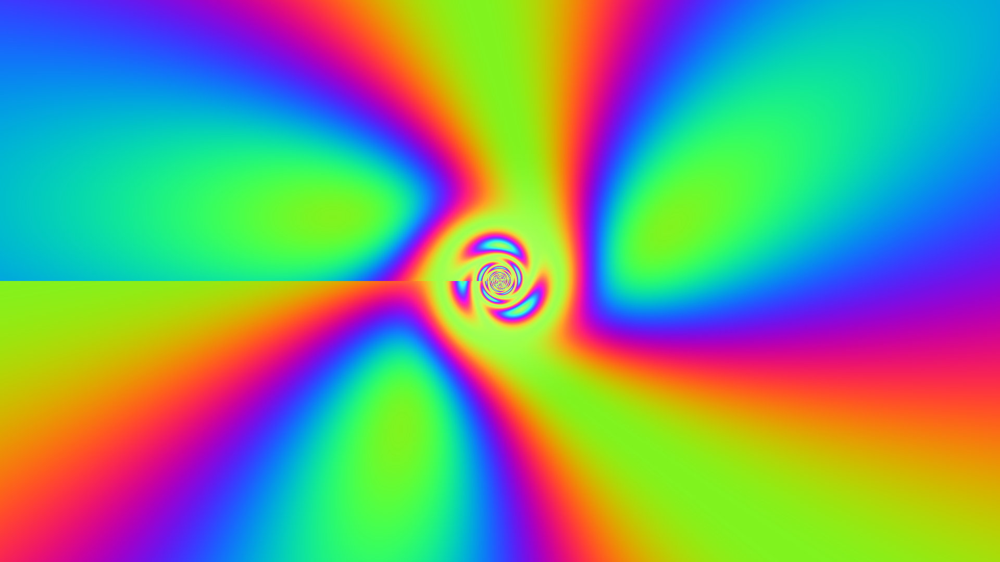

**Features:**
- Infinite corridor
- Perspective motion
- Grid pattern
- Speed variation

---

## Technical Details

### Shader Compilation

**macOS (Metal):**
- Shaders compiled at runtime using Metal compiler
- Supports live reloading during development
- Uses `#include "ShaderInterop.h"` for uniform buffers

**Linux (OpenGL):**
- GLSL 4.5 / OpenGL 3.3 core profile
- Uses `base/common.glsl` for uniform definitions
- Fragment shaders implement `vec4 effect_main(vec2 centered, vec2 uv)`

### Uniform Buffer

All shaders receive the following uniforms:

```glsl
layout(std140) uniform Uniforms {
    float time;           // Current time in seconds
    float speed;          // Animation speed multiplier
    vec2 resolution;      // Viewport resolution
    vec2 mouse;           // Mouse position (normalized)
    float mouseButtons;   // Bitmask of mouse buttons
    float intensity;      // Effect intensity
    vec4 date;            // Current date/time
    int frame;            // Frame number
    float deltaTime;      // Time since last frame
    float alpha;          // Cross-fade factor
    float gravity;        // Gravity constant
};
```

### Performance

- **Target FPS:** 60 FPS at 1920x1080
- **Dynamic Resolution:** Automatically scales down on thermal throttling
- **Memory Budget:** Respects GPU memory limits
- **Metal Features:** Uses Metal Performance Shaders where available

### File Structure

```
shaders/
├── base/
│   ├── common.glsl      # GLSL common definitions
│   ├── common.metal     # Metal common definitions
│   ├── utils.metal      # Metal utility functions
│   └── default.metal    # Default shader
├── effects/             # Visual effects (33 shaders)
├── music/               # Music-reactive (10 shaders)
├── audio/               # Audio visualization (1 shader)
├── neural/              # Neural network effects (1 shader)
├── system/
│   └── debug_overlay.metal  # Debug visualization
└── [root]/              # Classic & character shaders (23 shaders)
```

---

## Contributing

To add a new shader:

1. Create both `.metal` (macOS) and `.frag` (Linux) versions
2. Place in appropriate subdirectory
3. Follow naming convention: `lowercase_with_underscores`
4. Implement the standard interface
5. Generate screenshot and thumbnail
6. Update this documentation

---

## License

All shaders are part of ShaderCandy and follow the project's license terms.
